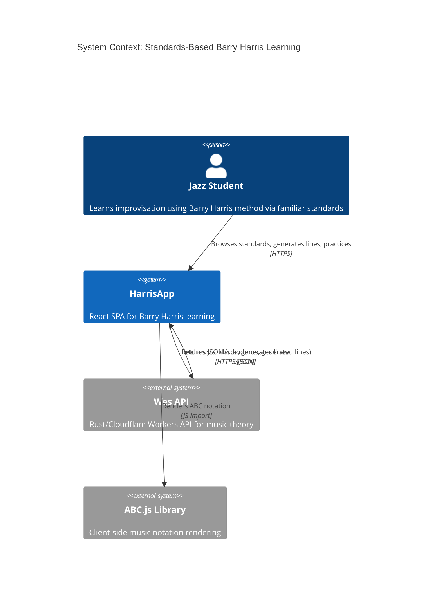
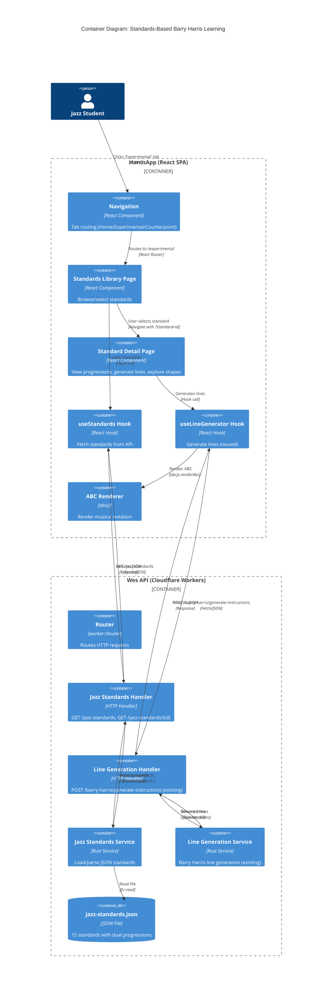
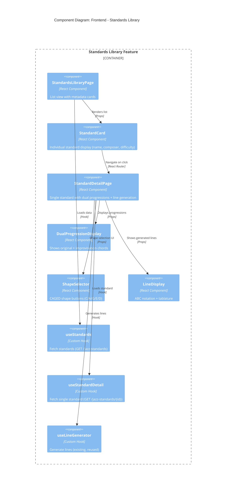
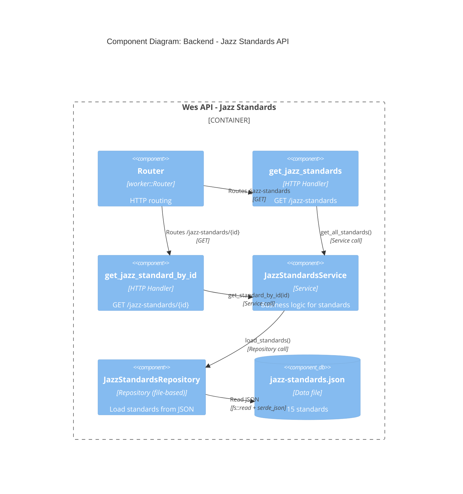

# Architecture: Standards-Based Barry Harris Learning

**Feature**: Experimental Tab - Standards Library (MVP: P1 + P2)
**Wave**: DESIGN (3 of 6)
**Date**: 2026-03-04
**Status**: Approved for DEVOPS wave handoff

---

## Executive Summary

The Standards Library feature enables jazz students to learn Barry Harris improvisation method via 15 curated jazz standards. Students browse standards, view dual progressions (original + Barry Harris simplified), generate melodic lines with one click, and explore 5 CAGED shapes. Architecture reuses existing line generation API, adds 2 new GET endpoints for standards, and creates 6 new React components. Zero database changes required (file-based data). Estimated delivery: 2-3 weeks for MVP.

**Key Metrics:**

- Frictionless entry: <30 seconds from app open to generation
- Fast generation: <3 seconds API response (p95)
- Effortless shape exploration: <3 seconds per shape switch

---

## Table of Contents

1. [System Context](#system-context)
2. [Architecture Diagrams](#architecture-diagrams)
3. [Component Specifications](#component-specifications)
4. [Data Models](#data-models)
5. [API Integration](#api-integration)
6. [Technology Stack](#technology-stack)
7. [Quality Attributes](#quality-attributes)
8. [Architecture Decision Records](#architecture-decision-records)
9. [Implementation Roadmap](#implementation-roadmap)

---

## System Context

### Business Drivers

**Primary Driver**: Time-to-market (frictionless entry <30s, fast generation <3s)

**Quality Attributes** (ISO 25010):

1. **Performance Efficiency** (HIGH): <30s entry, <3s API response p95
2. **Usability** (HIGH): Frictionless discovery, clear pedagogical value
3. **Reliability** (HIGH): Error handling, retry logic, loading states
4. **Maintainability** (MEDIUM): Clean boundaries, reuse patterns
5. **Functional Suitability** (HIGH): All 15 MVP user stories covered

### Critical Success Factors

1. **Frictionless Entry**: <30 seconds from app open to line generation
2. **Fast Generation**: <3 seconds API response (95th percentile)
3. **Dual Progression Clarity**: Educational value visible (original + improvisation)
4. **Quality Output**: Musical lines appropriate for difficulty level
5. **Effortless Shape Exploration**: <3 seconds per shape switch

### User Journey Summary

1. **Discovery** (5s): User clicks "Experimental" tab → Standards library visible
2. **Browse** (15s): User views 15 standards with metadata (difficulty, tempo, key)
3. **Select** (1s): User clicks "Autumn Leaves" → Detail page loads
4. **View Progressions** (10s): User sees dual progressions with explanation
5. **Generate Lines** (3s): User clicks "Generate Lines" → ABC notation renders (default: E shape)
6. **Explore Shapes** (10s per shape): User clicks "A" button → Lines regenerate
7. **Practice** (<5 min total): User moves to guitar with ABC notation

---

## Architecture Diagrams

### C4 Level 1: System Context



**Key External Systems:**

- **Wes API**: Backend providing standards data + line generation
- **ABC.js**: Client-side library for musical notation rendering (MIT license)

---

### C4 Level 2: Container Diagram



**Key Containers:**

- **Standards Library Page**: List view with 15 standards
- **Standard Detail Page**: Dual progressions + shape selector + line display
- **Jazz Standards Handler**: New backend endpoint (GET /jazz-standards, GET /jazz-standards/{id})
- **Line Generation Handler**: Existing endpoint (no changes)

---

### C4 Level 3: Component Diagram - Frontend



**Key Components:**

- **StandardsLibraryPage**: Entry point, grid of standards
- **StandardDetailPage**: Orchestrator for detail view (progressions, shape selector, lines)
- **DualProgressionDisplay**: Pedagogical value (shows Barry Harris simplification)
- **ShapeSelector**: CAGED shape exploration (C/A/G/E/D buttons)
- **LineDisplay**: ABC notation rendering via abcjs

---

### C4 Level 3: Component Diagram - Backend



**Key Components:**

- **get_jazz_standards**: Returns all 15 standards
- **get_jazz_standard_by_id**: Returns single standard by ID (e.g., "autumn-leaves")
- **JazzStandardsService**: Business logic (load, filter)
- **JazzStandardsRepository**: File system access (read JSON, parse with serde_json)

---

## Component Specifications

### Frontend Components

#### 1. `StandardsLibraryPage.tsx`

**Location**: `/Users/pedro/src/HarrisApp/src/pages/experimental/StandardsLibraryPage.tsx`

**Responsibility**: Display list of 15 jazz standards with metadata

**Props**: None (data from `useStandards` hook)

**State**:

- `standards: JazzStandard[]` (from hook)
- `loading: boolean` (from hook)
- `error: Error | null` (from hook)

**Layout**:

- Grid of `StandardCard` components (3 columns on desktop, 1 on mobile)
- Loading indicator during fetch
- Error message + Retry button on failure

**User Interactions**:

- Click standard card → Navigate to `/experimental/standards/{id}`

**Acceptance Criteria**:

- [ ] Displays 15 standards within 2 seconds
- [ ] Shows difficulty levels (beginner: 5, intermediate: 6, advanced: 4)
- [ ] Metadata visible: name, composer, key, difficulty, tempo, form
- [ ] Responsive grid layout (3 cols desktop, 1 col mobile)

---

#### 2. `StandardCard.tsx`

**Location**: `/Users/pedro/src/HarrisApp/src/components/experimental/StandardCard.tsx`

**Responsibility**: Display individual standard metadata

**Props**:

```typescript
interface StandardCardProps {
    standard: JazzStandard;
    onClick: (id: string) => void;
}
```

**State**: None (stateless)

**Layout**:

- Card with hover effect (Radix UI `Card`)
- Standard name (bold, large font)
- Composer (secondary text)
- Key, difficulty badge, tempo, form (metadata row)

**User Interactions**:

- Click card → Fire `onClick(standard.id)`

**Acceptance Criteria**:

- [ ] Displays all metadata fields
- [ ] Difficulty badge color-coded (green=beginner, yellow=intermediate, red=advanced)
- [ ] Hover effect indicates clickability
- [ ] Accessible (keyboard navigation, ARIA labels)

---

#### 3. `StandardDetailPage.tsx`

**Location**: `/Users/pedro/src/HarrisApp/src/pages/experimental/StandardDetailPage.tsx`

**Responsibility**: Orchestrate standard detail view (progressions, shape selector, line generation)

**Props**: None (reads URL param `?standard=autumn-leaves` or route param `/standards/:id`)

**State**:

```typescript
const [selectedShape, setSelectedShape] = useState<CAGEDShape>('E'); // Default: E shape
const [generatedLines, setGeneratedLines] = useState<Line[] | null>(null);
const [isGenerating, setIsGenerating] = useState(false);
```

**Hooks**:

- `useStandardDetail(id)` - Fetch standard by ID
- `useLineGenerator()` - Generate lines (reused from existing)

**Layout**:

- Standard header (name, composer, key)
- `DualProgressionDisplay` (original + improvisation)
- "Generate Lines" button (primary action)
- `ShapeSelector` (appears after first generation)
- `LineDisplay` (ABC notation + tablature)
- "Back to Library" link (breadcrumb)

**User Interactions**:

- Click "Generate Lines" → Call API with `chordsImprovisation` + default shape (E)
- Click shape button → Regenerate lines with new shape
- Click "Back to Library" → Navigate to `/experimental`

**Acceptance Criteria**:

- [ ] Loads standard within 2 seconds
- [ ] Displays dual progressions immediately
- [ ] Default shape (E) selected on mount
- [ ] Shape switch triggers regeneration within 3 seconds
- [ ] "Back to Library" navigates without losing state

---

#### 4. `DualProgressionDisplay.tsx`

**Location**: `/Users/pedro/src/HarrisApp/src/components/experimental/DualProgressionDisplay.tsx`

**Responsibility**: Show original + Barry Harris simplified progressions with explanation

**Props**:

```typescript
interface DualProgressionDisplayProps {
    chordsOriginal: string[];
    chordsImprovisation: string[];
    description: string;
}
```

**State**: None (stateless)

**Layout**:

- Two-column layout (side-by-side on desktop, stacked on mobile)
- Left/Top: "Original Progression (Melody/Comping)" with chords
- Right/Bottom: "Improvisation Progression (Barry Harris)" with chords
- Explanation text below (e.g., "Simplified version removes EbMaj7 passing chord.")

**User Interactions**: None (display only)

**Acceptance Criteria**:

- [ ] Both progressions clearly labeled
- [ ] Explanation text visible and readable
- [ ] Responsive layout (side-by-side desktop, stacked mobile)
- [ ] Chords displayed as badges or inline text

---

#### 5. `ShapeSelector.tsx`

**Location**: `/Users/pedro/src/HarrisApp/src/components/experimental/ShapeSelector.tsx`

**Responsibility**: CAGED shape buttons (C, A, G, E, D) with active state

**Props**:

```typescript
interface ShapeSelectorProps {
    activeShape: CAGEDShape;
    onShapeChange: (shape: CAGEDShape) => void;
    loading: boolean;
}

type CAGEDShape = 'C' | 'A' | 'G' | 'E' | 'D';
```

**State**: None (controlled component)

**Layout**:

- Horizontal row of 5 buttons (C, A, G, E, D)
- Active shape highlighted (primary color)
- Inactive shapes with hover effect
- Disabled during loading (loading spinner on active button)

**User Interactions**:

- Click shape button → Fire `onShapeChange(shape)` → Parent regenerates lines

**Acceptance Criteria**:

- [ ] 5 buttons labeled C, A, G, E, D
- [ ] Active shape visually distinct (primary color)
- [ ] Disabled during loading (no double-clicks)
- [ ] Accessible (keyboard navigation, ARIA labels)

---

#### 6. `LineDisplay.tsx`

**Location**: `/Users/pedro/src/HarrisApp/src/components/experimental/LineDisplay.tsx`

**Responsibility**: Render ABC notation + tablature

**Props**:

```typescript
interface LineDisplayProps {
    lines: Line[];
    chords: string[];
}

interface Line {
    pitches: string[];
    patterns: string[];
    tab: string;
}
```

**State**: None (uses ref for abcjs)

**Layout**:

- ABC notation rendered via abcjs (staff + notes + chord symbols)
- Tablature below notation (optional)
- Responsive width (scales with container)

**User Interactions**: None (display only)

**Rendering Logic**:

```typescript
const notationRef = useRef<HTMLDivElement>(null);

useEffect(() => {
    if (notationRef.current && lines.length > 0) {
        const abcNotation = convertToABC(lines[0].pitches, chords);
        abcjs.renderAbc(notationRef.current, abcNotation, {
            responsive: 'resize',
            add_classes: true,
            staffwidth: 500,
        });
    }
}, [lines, chords]);
```

**Acceptance Criteria**:

- [ ] ABC notation renders within 1 second
- [ ] Chord symbols aligned with notation
- [ ] Tablature visible below (optional)
- [ ] Responsive width (scales to mobile)

---

### Frontend Hooks

#### 7. `useStandards` Hook

**Location**: `/Users/pedro/src/HarrisApp/src/hooks/useStandards.ts`

**Responsibility**: Fetch all jazz standards from API

**API**: `GET /jazz-standards`

**Returns**:

```typescript
interface UseStandardsReturn {
    standards: JazzStandard[];
    loading: boolean;
    error: Error | null;
    refetch: () => Promise<void>;
}
```

**Implementation**:

```typescript
export const useStandards = (): UseStandardsReturn => {
    const [standards, setStandards] = useState<JazzStandard[]>([]);
    const [loading, setLoading] = useState(true);
    const [error, setError] = useState<Error | null>(null);

    const fetchStandards = async () => {
        setLoading(true);
        setError(null);
        try {
            const response = await fetch(`${API_BASE_URL}/jazz-standards`);
            if (!response.ok) throw new Error(`HTTP ${response.status}`);
            const data = await response.json();
            setStandards(data);
        } catch (err) {
            setError(err as Error);
        } finally {
            setLoading(false);
        }
    };

    useEffect(() => {
        void fetchStandards();
    }, []);

    return { standards, loading, error, refetch: fetchStandards };
};
```

**Acceptance Criteria**:

- [ ] Fetches standards on mount
- [ ] Returns loading state during fetch
- [ ] Returns error on failure (with retry via `refetch`)
- [ ] Caches standards after first fetch (no re-fetch on re-mount unless `refetch` called)

---

#### 8. `useStandardDetail` Hook

**Location**: `/Users/pedro/src/HarrisApp/src/hooks/useStandardDetail.ts`

**Responsibility**: Fetch single jazz standard by ID

**API**: `GET /jazz-standards/{id}`

**Parameters**:

```typescript
export const useStandardDetail = (id: string): UseStandardDetailReturn => {
    // ...
};
```

**Returns**:

```typescript
interface UseStandardDetailReturn {
    standard: JazzStandard | null;
    loading: boolean;
    error: Error | null;
    refetch: () => Promise<void>;
}
```

**Implementation**: Similar to `useStandards`, but with ID parameter

**Acceptance Criteria**:

- [ ] Fetches standard by ID on mount (or ID change)
- [ ] Returns 404 error if standard not found
- [ ] Returns loading state during fetch
- [ ] Retry available via `refetch`

---

### Backend Components

#### 9. `jazz_standards_handlers.rs`

**Location**: `/Users/pedro/src/wes/src/infrastructure/driving/http/jazz_standards_handlers.rs` (NEW)

**Responsibility**: HTTP layer for jazz standards endpoints

**Handlers**:

**`get_jazz_standards`**:

```rust
pub async fn get_jazz_standards(
    _req: Request,
    _ctx: RouteContext<AppContext>,
) -> worker::Result<Response> {
    let service = JazzStandardsService::new();
    match service.get_all_standards() {
        Ok(standards) => Response::from_json(&standards),
        Err(e) => Response::error(format!("Failed to load standards: {}", e), 500),
    }
}
```

**`get_jazz_standard_by_id`**:

```rust
pub async fn get_jazz_standard_by_id(
    _req: Request,
    ctx: RouteContext<AppContext>,
) -> worker::Result<Response> {
    let id = ctx.param("id").ok_or("Missing standard ID")?;
    let service = JazzStandardsService::new();
    match service.get_standard_by_id(id) {
        Ok(Some(standard)) => Response::from_json(&standard),
        Ok(None) => Response::error("Standard not found", 404),
        Err(e) => Response::error(format!("Failed to load standard: {}", e), 500),
    }
}
```

**Acceptance Criteria**:

- [ ] GET /jazz-standards returns 200 with array of 15 standards
- [ ] GET /jazz-standards/{id} returns 200 with single standard
- [ ] GET /jazz-standards/invalid-id returns 404
- [ ] Errors return 500 with message

---

#### 10. `jazz_standards_service.rs`

**Location**: `/Users/pedro/src/wes/src/services/jazz_standards_service.rs` (NEW)

**Responsibility**: Business logic for jazz standards

**Methods**:

**`get_all_standards`**:

```rust
impl JazzStandardsService {
    pub fn new() -> Self {
        Self {
            repo: JazzStandardsRepository::new(),
        }
    }

    pub fn get_all_standards(&self) -> Result<Vec<JazzStandard>, ServiceError> {
        self.repo.load_standards()
    }

    pub fn get_standard_by_id(&self, id: &str) -> Result<Option<JazzStandard>, ServiceError> {
        let standards = self.repo.load_standards()?;
        Ok(standards.into_iter().find(|s| s.id == id))
    }
}
```

**Acceptance Criteria**:

- [ ] Returns all 15 standards
- [ ] Filters by ID correctly
- [ ] Returns None for invalid ID (not error)
- [ ] Propagates file read errors

---

#### 11. `jazz_standards_repository.rs`

**Location**: `/Users/pedro/src/wes/src/infrastructure/driven/jazz_standards_repository.rs` (NEW)

**Responsibility**: Load standards from JSON file

**Implementation**:

```rust
pub struct JazzStandardsRepository;

impl JazzStandardsRepository {
    pub fn new() -> Self {
        Self
    }

    pub fn load_standards(&self) -> Result<Vec<JazzStandard>, RepositoryError> {
        let json_content = include_str!("../../../../data/jazz-standards.json");
        serde_json::from_str(json_content)
            .map_err(|e| RepositoryError::ParseError(e.to_string()))
    }
}
```

**Acceptance Criteria**:

- [ ] Reads `data/jazz-standards.json` at compile time (`include_str!`)
- [ ] Parses JSON with serde_json
- [ ] Returns 15 standards
- [ ] Returns error on parse failure

---

## Data Models

### Frontend Types

```typescript
// src/types/jazzStandards.ts

export interface JazzStandard {
    id: string;
    name: string;
    composer: string;
    key: string;
    chords_original: string[];
    chords_improvisation: string[];
    form: string;
    tempo: string;
    difficulty: 'beginner' | 'intermediate' | 'advanced';
    description: string;
}

export type CAGEDShape = 'C' | 'A' | 'G' | 'E' | 'D';

export interface Line {
    pitches: string[];
    patterns: string[];
    source_degree: number;
    target_degree: number;
    tab: string;
}

export interface GenerateLinesRequest {
    chords: string[];
    caged_shape: CAGEDShape;
    guitar_position: CAGEDShape;
}

export interface GenerateLinesResponse {
    transitions: {
        lines: Line[];
    }[];
}
```

---

### Backend Models

```rust
// src/infrastructure/driving/http/models/jazz_standards_models.rs

use serde::{Deserialize, Serialize};

#[derive(Debug, Clone, Serialize, Deserialize)]
pub struct JazzStandard {
    pub id: String,
    pub name: String,
    pub composer: String,
    pub key: String,
    pub chords_original: Vec<String>,
    pub chords_improvisation: Vec<String>,
    pub form: String,
    pub tempo: String,
    pub difficulty: Difficulty,
    pub description: String,
}

#[derive(Debug, Clone, Serialize, Deserialize)]
#[serde(rename_all = "lowercase")]
pub enum Difficulty {
    Beginner,
    Intermediate,
    Advanced,
}
```

---

## API Integration

### New Endpoints (Backend)

#### 1. GET /jazz-standards

**Description**: Returns all 15 jazz standards

**Request**: None

**Response** (200 OK):

```json
[
    {
        "id": "autumn-leaves",
        "name": "Autumn Leaves",
        "composer": "Joseph Kosma",
        "key": "G minor",
        "chords_original": ["Cm7", "F7", "BbMaj7", "EbMaj7", "Am7b5", "D7", "Gm7", "Gm7"],
        "chords_improvisation": ["Cm7", "F7", "BbMaj7", "Am7b5", "D7", "Gm7"],
        "form": "AABA",
        "tempo": "Medium Ballad",
        "difficulty": "beginner",
        "description": "Classic jazz standard, perfect for learning ii-V-I patterns. Simplified version removes EbMaj7 passing chord."
    }
    // ... 14 more standards
]
```

**Error Responses**:

- 500: "Failed to load standards: {error}"

---

#### 2. GET /jazz-standards/{id}

**Description**: Returns single jazz standard by ID

**Request**: None

**Path Parameter**: `id` (e.g., "autumn-leaves")

**Response** (200 OK):

```json
{
    "id": "autumn-leaves",
    "name": "Autumn Leaves"
    // ... same as above
}
```

**Error Responses**:

- 404: "Standard not found"
- 500: "Failed to load standard: {error}"

---

### Existing Endpoint (No Changes)

#### 3. POST /barry-harris/generate-instructions

**Description**: Generates Barry Harris lines for chord progression (EXISTING, REUSED)

**Request**:

```json
{
    "chords": ["Cm7", "F7", "BbMaj7", "Am7b5", "D7", "Gm7"],
    "caged_shape": "E",
    "guitar_position": "E"
}
```

**Response** (200 OK):

```json
{
    "transitions": [
        {
            "from_chords": ["Cm7", "F7"],
            "to_chords": ["BbMaj7"],
            "from_scale": "F Dominant",
            "to_scale": "Bb Major",
            "lines": [
                {
                    "pitches": ["F3", "A3", "C4", "E4", "D4", "Bb3"],
                    "patterns": ["ChordUp", "ScaleDown"],
                    "source_degree": 1,
                    "target_degree": 3,
                    "tab": "e|---5---7---9---|\n..."
                }
            ]
        }
    ]
}
```

---

## Technology Stack

### Frontend

| Technology   | Version | License    | Purpose                  |
| ------------ | ------- | ---------- | ------------------------ |
| React        | 19.x    | MIT        | UI framework             |
| TypeScript   | 5.x     | Apache 2.0 | Type safety              |
| React Router | v7      | MIT        | Routing                  |
| Tailwind CSS | v4      | MIT        | Styling                  |
| Radix UI     | Latest  | MIT        | Accessible components    |
| abcjs        | 6.x     | MIT        | Music notation rendering |
| Vite         | Latest  | MIT        | Build tool               |

---

### Backend

| Technology         | Version | License                | Purpose                |
| ------------------ | ------- | ---------------------- | ---------------------- |
| Rust               | 1.85+   | MIT/Apache 2.0         | Programming language   |
| Cloudflare Workers | Latest  | Proprietary (platform) | Serverless runtime     |
| worker crate       | Latest  | MIT/Apache 2.0         | Cloudflare Workers SDK |
| serde              | 1.x     | MIT/Apache 2.0         | JSON serialization     |
| serde_json         | 1.x     | MIT/Apache 2.0         | JSON parsing           |

---

## Quality Attributes

### Performance Efficiency

**Target**: <30s entry, <3s API response (p95)

**Strategy**:

- Standards load immediately on tab click (parallel fetch)
- No lazy loading for 15 standards (small payload ~10KB)
- Line generation reuses optimized existing API
- Client-side ABC rendering (no server round-trip)

**Measurement**:

- Lighthouse performance audit
- RUM (Real User Monitoring) for API response times
- p95 metric tracked in analytics

---

### Usability

**Target**: Frictionless discovery, clear pedagogical value

**Strategy**:

- "Experimental" tab prominent in navigation
- Standards library visible immediately (no nested menus)
- Dual progression display with explanation text
- Default shape (E) avoids decision paralysis
- Loading indicators during API calls

**Measurement**:

- User testing (time-to-first-generation <30s)
- Post-session survey ("Did you understand dual progressions?" >80% yes)

---

### Reliability

**Target**: Error handling, retry logic, loading states

**Strategy**:

- API timeout (5s) with retry button
- Network error detection with contextual messages
- 404 handling for invalid standard IDs
- Loading states prevent confusion ("Is it working?")

**Measurement**:

- Error rate <1% (API errors)
- Retry success rate >80%

---

### Maintainability

**Target**: Clean boundaries, reuse patterns

**Strategy**:

- Reuse `useLineGenerator` hook (no duplication)
- Component composition (StandardCard, DualProgressionDisplay)
- Service layer separation (backend: service → repository)
- No tight coupling (frontend doesn't know about backend structure)

**Measurement**:

- Code review (DRY violations flagged)
- Component reusability audit

---

## Architecture Decision Records

### ADR-001: Development Paradigm Selection

**Status**: Accepted

**Decision**:

- Frontend: OOP + Functional React Hooks (consistency)
- Backend: Object-Oriented (struct-based, confirmed in CLAUDE.md)

**Rationale**: Maintain consistency with existing codebase patterns

---

### ADR-002: No Repository Layer for Jazz Standards

**Status**: Accepted

**Decision**: Load standards directly in service layer via file system (`include_str!`)

**Rationale**: Static data (15 standards), no persistence needed. Avoid over-engineering.

**Alternatives Rejected**: Repository abstraction (YAGNI for MVP)

---

### ADR-003: Reuse Existing Line Generation API

**Status**: Accepted

**Decision**: Reuse `/barry-harris/generate-instructions` endpoint (no changes)

**Rationale**: Endpoint already supports `caged_shape` parameter. Zero backend changes for line generation.

**Alternatives Rejected**: New endpoint `/jazz-standards/{id}/generate-lines` (duplication)

---

### ADR-004: URL State for Standard Selection

**Status**: Accepted

**Decision**: Use URL params: `/experimental/standards/{id}` (e.g., `/experimental/standards/autumn-leaves`)

**Rationale**: Shareable URLs, browser back/forward support, RESTful convention

**Alternatives Rejected**: Query params (less semantic), local state only (no sharing)

---

### ADR-005: No Side-by-Side Shape Comparison (MVP)

**Status**: Accepted

**Decision**: Defer side-by-side comparison to V2. MVP uses sequential shape switching.

**Rationale**: Faster MVP delivery, validates sequential switching UX first

**Alternatives Rejected**: MVP with comparison (adds UI complexity, delays delivery)

---

### ADR-006: Client-Side ABC Rendering (abcjs)

**Status**: Accepted

**Decision**: Continue using abcjs for client-side ABC notation rendering

**Rationale**: Already integrated, MIT license, fast rendering, no backend changes

**Alternatives Rejected**: Server-side rendering (unnecessary overhead)

---

### ADR-007: No Pattern Labels in MVP

**Status**: Accepted

**Decision**: Generate lines without pattern labels in MVP (P3 deferred to V2)

**Rationale**: Focus on core value (standards + shapes), faster delivery

**Alternatives Rejected**: MVP with pattern labels (adds UI complexity)

---

### ADR-008: Default Shape Selection (E Shape)

**Status**: Accepted

**Decision**: Default to E shape for initial line generation

**Rationale**: E shape most common for jazz standards (domain expertise), avoids decision paralysis

**Alternatives Rejected**: No default (adds friction), A shape (less common), random (inconsistent)

---

## Implementation Roadmap

### Phase 1: Backend - Jazz Standards API (1 week)

**Scope**: Implement GET /jazz-standards and GET /jazz-standards/{id}

**Steps**:

1. Create `jazz_standards_models.rs` (data models)
2. Create `jazz_standards_repository.rs` (load JSON via `include_str!`)
3. Create `jazz_standards_service.rs` (business logic)
4. Create `jazz_standards_handlers.rs` (HTTP handlers)
5. Update `lib.rs` router (add new routes)
6. Write unit tests (service + repository)
7. Write E2E tests (API endpoints)

**Acceptance Criteria**:

- [ ] GET /jazz-standards returns 15 standards
- [ ] GET /jazz-standards/autumn-leaves returns single standard
- [ ] GET /jazz-standards/invalid returns 404
- [ ] All tests pass (unit + E2E)

---

### Phase 2: Frontend - Standards Library UI (1 week)

**Scope**: Implement standards list + detail pages

**Steps**:

1. Create `useStandards` hook (fetch all standards)
2. Create `useStandardDetail` hook (fetch single standard)
3. Create `StandardsLibraryPage` component
4. Create `StandardCard` component
5. Create `StandardDetailPage` component
6. Create `DualProgressionDisplay` component
7. Create `ShapeSelector` component
8. Create `LineDisplay` component (reuse existing ABC rendering)
9. Update `Navigation.tsx` (add "Experimental" tab)
10. Update `App.tsx` (add routes)

**Acceptance Criteria**:

- [ ] "Experimental" tab visible in navigation
- [ ] Standards library displays 15 standards
- [ ] Click standard → Navigate to detail page
- [ ] Dual progressions visible with explanation
- [ ] Generate Lines button triggers API call

---

### Phase 3: Integration & Testing (1 week)

**Scope**: Connect frontend to backend, test E2E flows

**Steps**:

1. Connect `useStandards` to GET /jazz-standards
2. Connect `useStandardDetail` to GET /jazz-standards/{id}
3. Connect line generation to existing API (POST /barry-harris/generate-instructions)
4. Test shape switching (C, A, G, E, D)
5. Test error handling (timeout, network error, 404)
6. Test loading states (standards, standard detail, line generation)
7. Write E2E tests (Vitest + Miniflare)
8. Performance testing (measure CSFs)

**Acceptance Criteria**:

- [ ] All 15 MVP user stories pass acceptance criteria
- [ ] All 5 CSFs met (frictionless entry <30s, generation <3s, etc.)
- [ ] Error handling verified (timeout, retry, 404)
- [ ] E2E tests pass (all scenarios green)

---

## Handoff Checklist

### For DEVOPS Wave (platform-architect)

- [x] Architecture document complete with C4 diagrams (L1, L2, L3)
- [x] Component specifications (11 components: 8 frontend, 3 backend)
- [x] Data models (frontend TypeScript, backend Rust)
- [x] API integration (2 new endpoints, 1 reused)
- [x] Technology stack justified with licenses
- [x] Quality attribute strategies (performance, usability, reliability)
- [x] 8 ADRs documented with rationale
- [x] Implementation roadmap (3 phases, 3 weeks)

### For DISTILL Wave (acceptance-designer)

- [ ] 15 MVP user stories mapped to architecture components
- [ ] Acceptance criteria per component (documented above)
- [ ] User journey validation (frictionless entry, shape exploration)
- [ ] Error scenarios covered (timeout, network, 404, 500)

---

## Success Validation

### Functional Validation

| Criterion                 | How to Validate               |
| ------------------------- | ----------------------------- |
| Standards load <2s        | Lighthouse audit + RUM        |
| Line generation <3s (p95) | API monitoring + analytics    |
| Shape switching <3s       | RUM + user testing            |
| Dual progressions visible | Manual QA + user testing      |
| Error retry works         | Integration tests + manual QA |

---

### User Story Coverage

| Epic                      | Stories | Components Covering                                                                                                                                            |
| ------------------------- | ------- | -------------------------------------------------------------------------------------------------------------------------------------------------------------- |
| Epic 1: Standards Library | 1.1-1.5 | `StandardsLibraryPage`, `StandardCard`, `StandardDetailPage`, `DualProgressionDisplay`, `LineDisplay`, `useStandards`, `useStandardDetail`, `useLineGenerator` |
| Epic 2: Shape Exploration | 2.1-2.3 | `ShapeSelector`, shape state management in `StandardDetailPage`, `useLineGenerator` with `caged_shape` param                                                   |
| Epic 3: Practice Flow     | 3.1-3.2 | URL navigation, "Back to Library" link, session state                                                                                                          |
| Epic 4: Error Handling    | 4.1-4.3 | Error boundaries in hooks, retry logic, contextual error messages                                                                                              |
| Epic 5: Performance       | 5.1-5.2 | Loading states, API timeout handling, musical quality validation                                                                                               |

**All 15 MVP user stories covered** ✓

---

## Appendix: File Structure

### Frontend (New Files)

```
/Users/pedro/src/HarrisApp/src/
├── pages/
│   └── experimental/
│       ├── StandardsLibraryPage.tsx (NEW)
│       └── StandardDetailPage.tsx (NEW)
├── components/
│   └── experimental/
│       ├── StandardCard.tsx (NEW)
│       ├── DualProgressionDisplay.tsx (NEW)
│       ├── ShapeSelector.tsx (NEW)
│       └── LineDisplay.tsx (NEW)
├── hooks/
│   ├── useStandards.ts (NEW)
│   └── useStandardDetail.ts (NEW)
└── types/
    └── jazzStandards.ts (NEW)
```

---

### Backend (New Files)

```
/Users/pedro/src/wes/src/
├── infrastructure/
│   ├── driving/
│   │   └── http/
│   │       ├── jazz_standards_handlers.rs (NEW)
│   │       └── models/
│   │           └── jazz_standards_models.rs (NEW)
│   └── driven/
│       └── jazz_standards_repository.rs (NEW)
└── services/
    └── jazz_standards_service.rs (NEW)
```

---

## Document Metadata

**Author**: Morgan (Solution Architect)
**Reviewer**: Atlas (Solution Architect Reviewer) - PENDING
**Date**: 2026-03-04
**Version**: 1.0
**Status**: Ready for Peer Review → DEVOPS Handoff

---

**Next Step**: Peer review by solution-architect-reviewer (Atlas) before handoff to platform-architect (DEVOPS wave).
