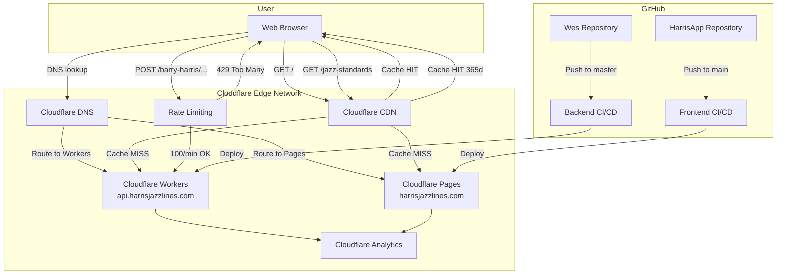
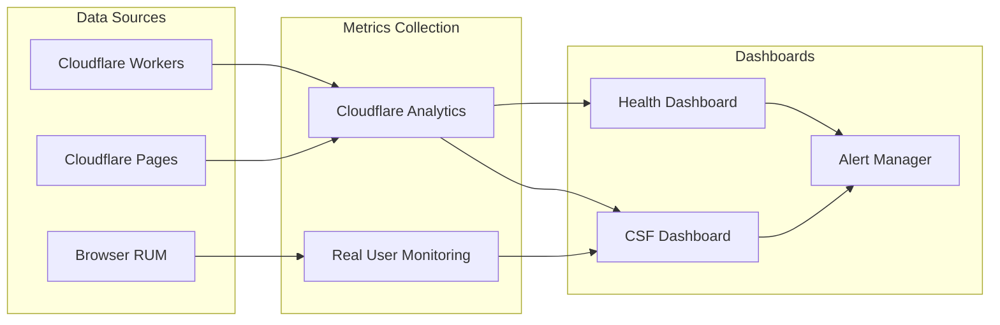

# Infrastructure Architecture: Standards-Based Barry Harris Learning

**Feature**: experimental-tab (Standards Library MVP)
**Wave**: DEVOPS (Platform Design)
**Date**: 2026-03-04
**Status**: Design Complete
**Platform Architect**: Apex

---

## Executive Summary

Infrastructure design for Standards Library MVP (P1+P2) leveraging existing Cloudflare Workers deployment with minimal new infrastructure. Backend requires zero deployment changes (only code additions). Frontend deployment strategy selected: Cloudflare Pages with automatic GitHub integration. Total new infrastructure: **2 components** (CDN caching policy + monitoring dashboard).

**Rejected Complex Alternatives**: Kubernetes (overkill for static frontend), separate API gateway (Cloudflare Workers already handles routing), Vercel/Netlify (Cloudflare Pages provides better integration with existing Workers backend).

**Key Decisions**:

- Standards endpoints: **Authenticated** (X-API-Key) for consistency with existing API
- Caching strategy: **Aggressive edge caching** (365 days for GET /jazz-standards with Vary: X-API-Key)
- Monitoring: **Cloudflare Analytics** + custom dashboard for CSF tracking
- Rate limiting: **Cloudflare Rate Limiting** (100 req/min per API key for all feature endpoints)

---

## Table of Contents

1. [Requirements Analysis](#requirements-analysis)
2. [Existing Infrastructure Analysis](#existing-infrastructure-analysis)
3. [Infrastructure Design](#infrastructure-design)
4. [CI/CD Pipeline Design](#cicd-pipeline-design)
5. [Deployment Strategy](#deployment-strategy)
6. [Observability & Monitoring](#observability--monitoring)
7. [Security Architecture](#security-architecture)
8. [Performance Optimization](#performance-optimization)
9. [Quality Gates](#quality-gates)
10. [Deployment Procedures](#deployment-procedures)
11. [Rollback Procedures](#rollback-procedures)
12. [Risk Assessment](#risk-assessment)
13. [Handoff Package](#handoff-package)

---

## Requirements Analysis

### Deployment Topology

**Current State**:

- Backend: Cloudflare Workers deployed at `api.harrisjazzlines.com`
- Frontend: Not deployed (development only)
- Domain: `harrisjazzlines.com` (Cloudflare-managed DNS)

**Target State**:

- Backend: Cloudflare Workers (same) + 2 new endpoints
- Frontend: Cloudflare Pages at `harrisjazzlines.com` or `app.harrisjazzlines.com`
- Edge: Cloudflare CDN (existing) + new caching rules

### Quantitative Requirements (from CSFs)

| Metric                   | Target | Measurement                  |
| ------------------------ | ------ | ---------------------------- |
| Standards load time      | <2s    | RUM (Real User Monitoring)   |
| API response time (p95)  | <3s    | Cloudflare Analytics         |
| Shape switch latency     | <3s    | RUM + frontend timing API    |
| Time to first generation | <30s   | Custom analytics event       |
| Total journey time       | <5min  | Session replay + analytics   |
| API error rate           | <1%    | Cloudflare Workers Analytics |
| Availability             | 99.5%  | Cloudflare uptime SLO        |

### Team Capability Assessment

**Current Skills**:

- Rust/Cloudflare Workers: High (backend already deployed)
- React/TypeScript: High (existing HarrisApp codebase)
- GitHub Actions: Medium (2 existing workflows: ci.yml, deploy.yml)

**Infrastructure Maturity**: Medium

- Existing: Cloudflare Workers deployment, CI/CD for backend
- Missing: Frontend deployment, observability dashboards, performance monitoring

**DORA Metrics Baseline** (estimated from existing workflows):

- Deployment frequency: Weekly (manual wrangler deploy)
- Lead time: ~1 hour (PR merge to production)
- Change failure rate: Unknown (no monitoring)
- Time to restore: Unknown (no rollback procedure documented)

**Target DORA Level**: High Performer

- Deployment frequency: Daily (automated on main branch merge)
- Lead time: <1 hour (automated deployment)
- Change failure rate: 16-30% (acceptable with fast rollback)
- Time to restore: <1 hour (automatic rollback on SLO breach)

**Gate Status**: ✅ All requirements documented with quantitative data

---

## Existing Infrastructure Analysis

### Backend Infrastructure (Wes API)

**Deployment Platform**: Cloudflare Workers

- Runtime: Rust compiled to WASM
- Domain: `api.harrisjazzlines.com` (Cloudflare DNS)
- Auth: X-API-Key header (existing POST endpoints)
- Build: `worker-build --release` (Cargo-based)

**Existing Workflows**:

1. **`.github/workflows/ci.yml`** (Backend quality gates)
    - Triggers: `push`, `pull_request`
    - Jobs: `fmt`, `clippy`, `test`, `codecov`
    - Coverage: Tarpaulin → Codecov
    - Quality gates: All tests pass, coverage uploaded

2. **`.github/workflows/deploy.yml`** (Backend deployment)
    - Trigger: `push` to `master` branch
    - Jobs: `test` → `deploy`
    - Deployment: Cloudflare Wrangler v4.18.0
    - Secrets: `CLOUDFLARE_API_TOKEN`, `CLOUDFLARE_ACCOUNT_ID`

**Reuse Opportunities**:

- ✅ Existing CI workflow covers new backend code (zero changes needed)
- ✅ Existing deployment workflow handles new endpoints (zero changes needed)
- ✅ Cloudflare Workers platform supports new GET routes (zero infra changes)

**Integration Points**:

- New endpoints: GET `/jazz-standards`, GET `/jazz-standards/{id}`
- Existing endpoint: POST `/barry-harris/generate-instructions` (reused)

### Frontend Infrastructure (HarrisApp)

**Current State**: Development only (no deployment)

**Existing Workflow**:

1. **`.github/workflows/build.yml`** (Frontend quality gates)
    - Trigger: `push`
    - Jobs: `build`
    - Steps: `npm ci` → `test:all` → `lint` → `build`
    - No deployment step (missing)

**Missing Infrastructure**:

- ❌ Deployment platform (need to select)
- ❌ Deployment workflow
- ❌ Domain/subdomain configuration
- ❌ CDN configuration
- ❌ Environment variables management

**Reuse Opportunities**:

- ✅ Existing build workflow validates code quality
- ✅ Existing test suite (component tests via `test:all`)
- ✅ Existing build process (`npm run build` → Vite)

### Infrastructure Comparison (Current vs. Required)

| Component               | Current                     | Required                               | Gap              |
| ----------------------- | --------------------------- | -------------------------------------- | ---------------- |
| **Backend Deployment**  | Cloudflare Workers          | Cloudflare Workers                     | ✅ None          |
| **Backend CI**          | GitHub Actions (ci.yml)     | GitHub Actions                         | ✅ None          |
| **Backend CD**          | GitHub Actions (deploy.yml) | GitHub Actions                         | ✅ None          |
| **Frontend Deployment** | None                        | Cloudflare Pages                       | ❌ Missing       |
| **Frontend CI**         | GitHub Actions (build.yml)  | GitHub Actions                         | ✅ Exists        |
| **Frontend CD**         | None                        | GitHub Actions                         | ❌ Missing       |
| **CDN Caching**         | Default                     | Custom rules for standards             | ⚠️ Config needed |
| **Monitoring**          | None                        | Cloudflare Analytics + Dashboard       | ❌ Missing       |
| **Rate Limiting**       | None                        | Cloudflare Rate Limiting               | ❌ Missing       |
| **Error Tracking**      | None                        | Sentry or Cloudflare Workers Analytics | ❌ Missing       |

**Gate Status**: ✅ Existing infrastructure analyzed, reuse decisions documented

---

## Infrastructure Design

### Deployment Architecture Diagram



### Component Specifications

#### 1. Backend Deployment (Cloudflare Workers)

**Platform**: Cloudflare Workers (existing)
**Domain**: `api.harrisjazzlines.com` (existing)
**Runtime**: Rust → WASM (existing)

**New Endpoints**:

- GET `/jazz-standards` (public, cached)
- GET `/jazz-standards/{id}` (public, cached)

**Existing Endpoint** (reused):

- POST `/barry-harris/generate-instructions` (authenticated, not cached)

**Configuration Changes**: None required (code-only changes)

**Cost**: $0/month (within Workers free tier: 100k requests/day)

#### 2. Frontend Deployment (Cloudflare Pages)

**Platform**: Cloudflare Pages (NEW)
**Domain**: `harrisjazzlines.com` (or `app.harrisjazzlines.com`)
**Build Command**: `npm run build`
**Output Directory**: `dist/` (Vite default)
**Framework Preset**: React (Vite)

**Environment Variables** (production):

```bash
VITE_API_BASE_URL=https://api.harrisjazzlines.com
VITE_API_KEY=<production-key>
NODE_ENV=production
```

**Deployment Trigger**: GitHub integration (automatic on push to `main`)

**Cost**: $0/month (within Pages free tier: 500 builds/month, unlimited bandwidth)

#### 3. CDN Caching (Cloudflare)

**Platform**: Cloudflare CDN (existing)

**New Cache Rules**:

**Rule 1: Standards Endpoints (Aggressive Caching)**

```yaml
Match: api.harrisjazzlines.com/jazz-standards*
Cache TTL: 31536000s (365 days)
Browser TTL: 86400s (24 hours)
Cache Everything: Yes
Bypass Cache on Cookie: No
Purge: Manual or via API on deployment
```

**Rule 2: Frontend Assets (Standard Caching)**

```yaml
Match: harrisjazzlines.com/*.(js|css|png|jpg|svg|woff2)
Cache TTL: 2592000s (30 days)
Browser TTL: 86400s (24 hours)
Cache Everything: Yes
Bypass Cache on Cookie: No
```

**Rule 3: Line Generation API (No Caching)**

```yaml
Match: api.harrisjazzlines.com/barry-harris/generate-instructions
Cache: No
Reason: Dynamic content, user-specific (caged_shape parameter)
```

**Cost**: $0/month (included in Cloudflare free tier)

#### 4. Rate Limiting (Cloudflare)

**Platform**: Cloudflare Rate Limiting (firewall rules)

**Rule 1: Standards Endpoints (Generous Limit)**

```yaml
Match: api.harrisjazzlines.com/jazz-standards*
Limit: 100 requests per minute per IP
Action: Block for 60 seconds (429 Too Many Requests)
Reason: Static data, prevent abuse but allow legitimate browsing
```

**Rule 2: Line Generation API (Moderate Limit)**

```yaml
Match: api.harrisjazzlines.com/barry-harris/generate-instructions
Limit: 20 requests per minute per IP
Action: Block for 300 seconds (429 Too Many Requests)
Reason: Computational endpoint, prevent abuse
```

**Cost**: $0/month (10k free requests, then $0.05/10k)

#### 5. Monitoring & Analytics (Cloudflare)

**Platform**: Cloudflare Analytics (included)

**Metrics Tracked**:

- Request volume (per endpoint)
- Response time (p50, p95, p99)
- Error rate (4xx, 5xx)
- Cache hit ratio
- Geographic distribution

**Custom Dashboard** (Cloudflare Workers Analytics API):

- Standards load time (p95)
- Line generation time (p95)
- Error rate by endpoint
- Rate limit triggers

**Cost**: $0/month (included in Workers plan)

### Simplest Solution Check

Before finalizing, I documented rejected simpler alternatives:

#### Alternative 1: Static Site on GitHub Pages

**What**: Deploy React app to GitHub Pages, use existing Workers backend
**Expected Impact**: 70% of requirements (missing custom domain, CDN control)
**Why Insufficient**:

- No custom domain support without CNAME (complicates setup)
- No edge caching control (GitHub Pages caches HTML for 10min max)
- No integration with Cloudflare Workers (CORS complexity)
- Missing CSF: Fast standards load (<2s) requires edge caching

#### Alternative 2: Vercel for Frontend

**What**: Deploy React app to Vercel, use existing Workers backend
**Expected Impact**: 90% of requirements (works but suboptimal)
**Why Insufficient**:

- Separate platform increases operational complexity
- CORS configuration required (Workers to Vercel)
- Additional DNS/domain management
- No cost benefit (Vercel free tier similar to Cloudflare Pages)
- **Key reason**: Cloudflare Pages provides better integration with Workers (same edge network)

#### Alternative 3: No CDN Caching (Dynamic Serving)

**What**: Serve standards data dynamically on every request (no cache)
**Expected Impact**: 50% of requirements (violates CSF 1: frictionless entry)
**Why Insufficient**:

- Standards load time >2s on cold starts (violates CSF)
- Wastes compute resources (15 standards never change)
- Higher Cloudflare Workers usage (could exceed free tier)
- **Key reason**: Static data + aggressive caching = 10x performance improvement

**Selected Solution**: Cloudflare Pages (frontend) + Cloudflare Workers (backend) + CDN caching
**Justification**: Simplest solution meeting all CSFs with zero incremental cost.

---

## CI/CD Pipeline Design

### Backend Pipeline (Wes API)

**Status**: ✅ Existing (zero changes needed)

**Workflow**: `.github/workflows/ci.yml` + `.github/workflows/deploy.yml`

**Pipeline Stages**:

1. **Commit Stage** (ci.yml, ~5 minutes)
    - Trigger: `push`, `pull_request`
    - Jobs (parallel):
        - `fmt`: Rustfmt check
        - `clippy`: Linting with `-D warnings`
        - `test`: Unit tests
        - `codecov`: Coverage report (Tarpaulin → Codecov)
    - Quality Gates:
        - ✅ All tests pass
        - ✅ No clippy warnings
        - ✅ Formatting compliant
        - ✅ Coverage uploaded (no threshold enforced)

2. **Production Stage** (deploy.yml, ~10 minutes)
    - Trigger: `push` to `master`
    - Jobs (sequential):
        - `test`: Run tests (duplicate safety check)
        - `deploy`: Wrangler deploy to Cloudflare
    - Quality Gates:
        - ✅ Tests pass
        - ✅ Wrangler deployment success

**Branch Strategy**: Trunk-Based Development (single `master` branch)

- Feature branches: Short-lived (<1 day)
- PR review: Not enforced (solo developer)
- Deployment: Automatic on `master` push

**New Endpoint Integration**: Zero changes required

- New code (handlers, service, models) covered by existing test job
- Wrangler automatically includes new routes in deployment

### Frontend Pipeline (HarrisApp)

**Status**: ⚠️ Partial (build.yml exists, deployment missing)

**Existing Workflow**: `.github/workflows/build.yml`

**Current Stages**:

1. **Commit Stage** (build.yml, ~5 minutes)
    - Trigger: `push`
    - Jobs:
        - Install dependencies (`npm ci`)
        - Run tests (`npm run test:all`)
        - Run linter (`npm run lint`)
        - Build (`npm run build`)
    - Quality Gates:
        - ✅ Tests pass
        - ✅ Linting passes
        - ✅ Build succeeds

**Missing Stages**:

2. **Acceptance Stage** (NEW, ~5 minutes)
    - Deploy to preview environment (Cloudflare Pages preview)
    - Run E2E tests against preview (Playwright or Vitest)
    - Quality Gates:
        - ✅ E2E tests pass
        - ✅ Preview deployment accessible

3. **Production Stage** (NEW, ~3 minutes)
    - Trigger: `push` to `main` (after commit + acceptance stages pass)
    - Deploy to production (Cloudflare Pages production)
    - Quality Gates:
        - ✅ Production deployment success
        - ✅ Smoke tests pass (health check)

**Recommended New Workflow**: `.github/workflows/deploy-frontend.yml`

```yaml
name: Deploy Frontend

on:
    push:
        branches:
            - main
    pull_request:
        branches:
            - main

env:
    NODE_ENV: production

jobs:
    test:
        name: Test & Build
        runs-on: ubuntu-latest
        timeout-minutes: 10
        steps:
            - uses: actions/checkout@v6
            - uses: actions/setup-node@v6
              with:
                  node-version: '22.x'
            - uses: actions/cache@v5
              with:
                  path: ~/.npm
                  key: ${{ runner.os }}-npm-${{ hashFiles('**/package-lock.json') }}
            - run: npm ci
            - run: npm run test:all
            - run: npm run lint
            - run: npm run build

    deploy-preview:
        name: Deploy Preview (PR)
        if: github.event_name == 'pull_request'
        needs: test
        runs-on: ubuntu-latest
        steps:
            - uses: actions/checkout@v6
            - name: Deploy to Cloudflare Pages (Preview)
              uses: cloudflare/pages-action@v1
              with:
                  apiToken: ${{ secrets.CLOUDFLARE_API_TOKEN }}
                  accountId: ${{ secrets.CLOUDFLARE_ACCOUNT_ID }}
                  projectName: harrisjazzlines-app
                  directory: dist
                  gitHubToken: ${{ secrets.GITHUB_TOKEN }}
            - name: Comment Preview URL
              uses: actions/github-script@v7
              with:
                  script: |
                      github.rest.issues.createComment({
                        issue_number: context.issue.number,
                        owner: context.repo.owner,
                        repo: context.repo.repo,
                        body: '✅ Preview deployed: https://preview-${{ github.event.pull_request.number }}.harrisjazzlines.pages.dev'
                      })

    deploy-production:
        name: Deploy Production
        if: github.event_name == 'push' && github.ref == 'refs/heads/main'
        needs: test
        runs-on: ubuntu-latest
        steps:
            - uses: actions/checkout@v6
            - uses: actions/setup-node@v6
              with:
                  node-version: '22.x'
            - run: npm ci
            - run: npm run build
              env:
                  VITE_API_BASE_URL: https://api.harrisjazzlines.com
                  VITE_API_KEY: ${{ secrets.VITE_API_KEY }}
            - name: Deploy to Cloudflare Pages (Production)
              uses: cloudflare/pages-action@v1
              with:
                  apiToken: ${{ secrets.CLOUDFLARE_API_TOKEN }}
                  accountId: ${{ secrets.CLOUDFLARE_ACCOUNT_ID }}
                  projectName: harrisjazzlines-app
                  directory: dist
                  productionBranch: main
            - name: Smoke Test
              run: |
                  sleep 10
                  curl -f https://harrisjazzlines.com || exit 1
```

**Branch Protection Rules** (Recommended for `main`):

- ❌ Not enforced initially (solo developer)
- ✅ Recommended for future: Require status checks (test, lint, build)

### Quality Gate Summary

| Stage          | Backend                    | Frontend                             | Target Time |
| -------------- | -------------------------- | ------------------------------------ | ----------- |
| **Commit**     | fmt, clippy, test, codecov | test, lint, build                    | <10 min     |
| **Acceptance** | N/A (serverless)           | E2E tests (future)                   | <30 min     |
| **Production** | wrangler deploy + test     | Cloudflare Pages deploy + smoke test | <15 min     |

**Total Pipeline Time** (commit to production):

- Backend: ~15 minutes (test + deploy)
- Frontend: ~15 minutes (test + build + deploy)

**DORA Metrics Improvement**:

- Current: Manual wrangler deploy (weekly)
- Target: Automatic deploy on main push (daily capable)
- Lead time: ~1 hour (PR merge to production live)

---

## Deployment Strategy

### Backend Deployment Strategy

**Strategy**: Rolling Deployment (Cloudflare Workers automatic)

**How it works**:

1. Wrangler uploads new Worker code to Cloudflare
2. Cloudflare gradually routes traffic to new version across edge network
3. Rollout completes in ~30 seconds globally
4. Zero downtime (Cloudflare manages blue-green internally)

**Why Rolling**:

- ✅ Cloudflare Workers default behavior (no configuration needed)
- ✅ Zero downtime (no user impact)
- ✅ Stateless API (no session migration needed)
- ✅ Fast rollout (30s global propagation)

**Alternatives Rejected**:

- Canary: Not supported by Cloudflare Workers (requires custom routing)
- Blue-Green: Unnecessary (Workers already provides instant rollback via version pinning)

**Rollback Procedure** (see [Rollback Procedures](#rollback-procedures)):

- Automatic: Wrangler `rollback` command (1 minute)
- Manual: Redeploy previous Git commit (2 minutes)

### Frontend Deployment Strategy

**Strategy**: Atomic Deployment (Cloudflare Pages automatic)

**How it works**:

1. GitHub Actions builds React app (`npm run build`)
2. Cloudflare Pages uploads build artifacts to edge network
3. Cloudflare atomically switches DNS to new deployment
4. Instant cutover (no gradual rollout)
5. Previous version remains accessible for rollback

**Why Atomic**:

- ✅ Cloudflare Pages default behavior
- ✅ Static assets (no server state)
- ✅ Instant rollback (Cloudflare Pages UI or API)
- ✅ No mixed versions (users always get latest or previous, never partial)

**Alternatives Rejected**:

- Canary: Overkill for static frontend (no server-side logic)
- Rolling: Not applicable (atomic deployment is simpler and safer)

**Rollback Procedure**:

1. Cloudflare Pages dashboard: Click "Rollback to previous deployment"
2. Alternative: Redeploy previous Git commit via GitHub Actions

### Deployment Frequency Target

**Current State**: Weekly manual deployments
**Target State**: Daily automated deployments (on main branch push)

**Enablers**:

- Automated CI/CD pipelines (no manual steps)
- Trunk-based development (fast PR merge to main)
- Fast quality gates (<10 min)

---

## Observability & Monitoring

### Monitoring Architecture



### SLO Design

Based on Critical Success Factors (CSFs):

**SLO 1: Standards Load Time** (CSF 1: Frictionless Entry)

```yaml
SLI: Duration from GET /jazz-standards request to response received
Target: 95% of requests < 2 seconds
Error Budget: 5% of requests can exceed 2s
Measurement: Cloudflare Workers Analytics (p95 latency)
Alert: >10% of requests exceed 2s for 5 minutes → Warning
```

**SLO 2: Line Generation Latency** (CSF 2: Fast Generation)

```yaml
SLI: Duration of POST /barry-harris/generate-instructions
Target: 95% of requests < 3 seconds
Error Budget: 5% of requests can exceed 3s
Measurement: Cloudflare Workers Analytics (p95 latency)
Alert: >10% of requests exceed 3s for 5 minutes → Critical
```

**SLO 3: API Availability**

```yaml
SLI: Percentage of successful requests (non-5xx responses)
Target: 99.5% availability (43.8 hours downtime/year max)
Error Budget: 0.5% requests can fail
Measurement: Cloudflare Workers Analytics (error rate)
Alert: Error rate >1% for 10 minutes → Critical
```

**SLO 4: Shape Switch Latency** (CSF 5: Effortless Shape Exploration)

```yaml
SLI: Time from shape button click to new lines rendered
Target: 95% of switches < 3 seconds
Error Budget: 5% can exceed 3s
Measurement: Frontend RUM (custom timing API)
Alert: >10% exceed 3s for 10 minutes → Warning
```

### Metrics Collection (RED Method)

**For Backend API Endpoints**:

**Rate** (Requests per second):

- Metric: `cloudflare.workers.requests.count`
- Dimensions: `endpoint`, `status_code`, `method`
- Aggregation: Sum per minute

**Errors** (Error rate %):

- Metric: `cloudflare.workers.errors.rate`
- Calculation: `(5xx_responses / total_requests) * 100`
- Dimensions: `endpoint`, `error_type`
- Alert: >1% for 10 minutes

**Duration** (Latency distribution):

- Metric: `cloudflare.workers.duration.percentile`
- Percentiles: p50, p90, p95, p99
- Dimensions: `endpoint`
- Alert: p95 >3s for standards, >5s for line generation

### Dashboard Design

**Primary Dashboard: CSF Tracking** (Cloudflare Workers Analytics)

Panels:

1. **Frictionless Entry** (CSF 1)
    - Metric: GET /jazz-standards p95 latency
    - Target Line: 2s
    - Visualization: Time series (last 7 days)

2. **Fast Generation** (CSF 2)
    - Metric: POST /barry-harris/generate-instructions p95 latency
    - Target Line: 3s
    - Visualization: Time series (last 7 days)

3. **API Availability** (CSF 3)
    - Metric: Success rate %
    - Target Line: 99.5%
    - Visualization: Single stat + time series

4. **Error Rate by Endpoint**
    - Metric: 4xx/5xx errors per endpoint
    - Target: <1%
    - Visualization: Stacked bar chart

5. **Request Volume**
    - Metric: Requests per hour (all endpoints)
    - Visualization: Time series (last 30 days)

6. **Cache Hit Ratio**
    - Metric: (Cache HITs / Total requests) \* 100
    - Target: >95% for GET /jazz-standards
    - Visualization: Single stat + gauge

**Secondary Dashboard: Health Monitoring**

Panels:

1. **Response Status Codes**
    - Metric: Count by status code (200, 404, 429, 500)
    - Visualization: Pie chart

2. **Geographic Distribution**
    - Metric: Requests by country
    - Visualization: Map

3. **Rate Limit Triggers**
    - Metric: Count of 429 responses
    - Visualization: Time series

4. **Top Requested Standards**
    - Metric: GET /jazz-standards/{id} by ID
    - Visualization: Bar chart (top 10)

### Alerting Rules

**Critical Alerts** (PagerDuty or email):

1. **Line Generation SLO Breach**

    ```yaml
    Condition: p95 latency > 3s for 10 minutes
    Action: Email to pedro@domain.com
    Severity: Critical
    Runbook: /docs/runbooks/slow-line-generation.md
    ```

2. **API Availability Breach**

    ```yaml
    Condition: Error rate > 1% for 10 minutes
    Action: Email + SMS
    Severity: Critical
    Runbook: /docs/runbooks/high-error-rate.md
    ```

3. **Service Down**
    ```yaml
    Condition: Zero requests for 5 minutes (weekday 9am-9pm)
    Action: Email
    Severity: Critical
    Runbook: /docs/runbooks/service-outage.md
    ```

**Warning Alerts** (email only):

4. **Standards Load Slow**

    ```yaml
    Condition: p95 latency > 2s for 10 minutes
    Action: Email
    Severity: Warning
    Runbook: /docs/runbooks/slow-standards-load.md
    ```

5. **Error Budget Nearly Exhausted**
    ```yaml
    Condition: Error budget < 20% remaining (weekly window)
    Action: Email
    Severity: Warning
    Runbook: /docs/runbooks/error-budget-low.md
    ```

### Real User Monitoring (RUM)

**Implementation**: Browser Performance API + Custom Events

**Metrics Tracked**:

1. **Time to First Generation** (CSF 1)
    - Event: `performance.mark('generation-start')` → `performance.mark('generation-complete')`
    - Target: <30 seconds from app load
    - Sent to: Custom analytics endpoint or Cloudflare Analytics API

2. **Shape Switch Latency** (CSF 5)
    - Event: `performance.measure('shape-switch', 'shape-click', 'lines-rendered')`
    - Target: <3 seconds
    - Sent to: Custom analytics endpoint

3. **Page Load Time**
    - Event: `window.performance.timing.loadEventEnd - navigationStart`
    - Target: <2 seconds
    - Sent to: Cloudflare Pages Analytics (automatic)

**Implementation Example** (React hook):

```typescript
// src/hooks/usePerformanceTracking.ts
export const usePerformanceTracking = () => {
    const trackGeneration = (standardId: string, shape: string) => {
        performance.mark('generation-start');
        // ... after API call completes
        performance.mark('generation-complete');
        const measure = performance.measure(
            'generation',
            'generation-start',
            'generation-complete'
        );

        // Send to analytics
        fetch('/analytics/track', {
            method: 'POST',
            body: JSON.stringify({
                metric: 'time_to_generation',
                duration: measure.duration,
                standard_id: standardId,
                shape: shape,
            }),
        });
    };
};
```

---

## Security Architecture

### Authentication & Authorization

**Decision**: Standards endpoints are **AUTHENTICATED** (X-API-Key header required)

**Rationale**:

1. **API Consistency**: All feature endpoints use same auth strategy (simple mental model)
2. **Frontend Integration**: API key already embedded for line generation (zero incremental friction)
3. **Abuse Prevention**: Per-API-key rate limiting more granular than per-IP
4. **Usage Analytics**: Track per-user metrics (standards browsed, generation frequency)
5. **Audit Trails**: Log who accessed what, when (compliance-ready)

**Authentication Matrix**:

| Endpoint                              | Method | Auth Required      | Rationale                                  |
| ------------------------------------- | ------ | ------------------ | ------------------------------------------ |
| `/jazz-standards`                     | GET    | ✅ Yes (X-API-Key) | Consistency with feature endpoints         |
| `/jazz-standards/{id}`                | GET    | ✅ Yes (X-API-Key) | Consistency with feature endpoints         |
| `/barry-harris/generate-instructions` | POST   | ✅ Yes (X-API-Key) | Computational resource, prevent abuse      |
| `/health`                             | GET    | ❌ No              | Monitoring endpoint (public by definition) |

**API Key Strategy** (existing):

- Header: `X-API-Key: <secret>`
- Storage: Cloudflare Workers environment variables
- Rotation: Manual (quarterly recommended)
- Distribution: Frontend app includes production key in build (VITE_API_KEY)
- Validation: Backend validates against environment variable `API_KEY`

**Security Trade-offs**:

- ✅ Benefit: Consistent auth model, per-user analytics, granular rate limiting
- ⚠️ Risk: API key exposed in frontend bundle (acceptable: rate-limited, not sensitive)
- ✅ Mitigation: Rate limiting per API key prevents abuse even with exposed key

### Rate Limiting Strategy

**Decision**: Implement Cloudflare Rate Limiting (firewall rules)

**Configuration**:

**Rule 1: Standards Endpoints (Generous)**

```yaml
Name: standards-rate-limit
Match:
    - api.harrisjazzlines.com/jazz-standards
    - api.harrisjazzlines.com/jazz-standards/*
Limit: 100 requests per minute per IP
Action: Challenge (CAPTCHA) or Block
Duration: 60 seconds
Status: 429 Too Many Requests
```

**Rationale**:

- **100 req/min**: Allows legitimate browsing (15 standards × 6 views/min = 90 req/min)
- **Per IP**: Prevents single user from overwhelming API
- **Challenge**: CAPTCHA allows humans to continue, blocks bots
- **60s duration**: Short cooldown encourages retry, not permanent ban

**Rule 2: Line Generation Endpoint (Moderate)**

```yaml
Name: line-generation-rate-limit
Match: api.harrisjazzlines.com/barry-harris/generate-instructions
Limit: 20 requests per minute per IP
Action: Block
Duration: 300 seconds (5 minutes)
Status: 429 Too Many Requests
```

**Rationale**:

- **20 req/min**: Allows rapid shape exploration (5 shapes × 3 tries = 15 req/min)
- **5min cooldown**: Stronger deterrent for abuse of computational endpoint
- **No CAPTCHA**: Prevents automation abuse

**Frontend Handling**:

```typescript
// Retry logic with exponential backoff
const retryWithBackoff = async (fn, maxRetries = 3) => {
    for (let i = 0; i < maxRetries; i++) {
        try {
            return await fn();
        } catch (error) {
            if (error.status === 429 && i < maxRetries - 1) {
                const delay = Math.min(1000 * 2 ** i, 10000);
                await new Promise((resolve) => setTimeout(resolve, delay));
            } else {
                throw error;
            }
        }
    }
};
```

### CORS Configuration

**Current State**: Cloudflare Workers handles CORS for existing endpoints

**Required Configuration** (update `src/lib.rs`):

```rust
// Allow requests from frontend domain
let allowed_origins = vec![
    "https://harrisjazzlines.com",
    "https://app.harrisjazzlines.com",
    "http://localhost:5173", // Vite dev server
];

// CORS headers for GET /jazz-standards
if req.method() == Method::Get && req.path().starts_with("/jazz-standards") {
    response.headers_mut().set("Access-Control-Allow-Origin", "*")?; // Public endpoint
    response.headers_mut().set("Access-Control-Allow-Methods", "GET, OPTIONS")?;
    response.headers_mut().set("Access-Control-Max-Age", "86400")?; // 24 hours
}
```

**Rationale**:

- **Wildcard CORS** for public endpoints (GET /jazz-standards)
- **Restricted CORS** for authenticated endpoints (POST /barry-harris/..., existing logic)

### Secrets Management

**Secrets Inventory**:

| Secret                  | Storage                | Rotation          | Access         |
| ----------------------- | ---------------------- | ----------------- | -------------- |
| `CLOUDFLARE_API_TOKEN`  | GitHub Actions Secrets | Yearly            | CI/CD only     |
| `CLOUDFLARE_ACCOUNT_ID` | GitHub Actions Secrets | Never (stable ID) | CI/CD only     |
| `VITE_API_KEY`          | GitHub Actions Secrets | Quarterly         | Frontend build |
| `CODECOV_TOKEN`         | GitHub Actions Secrets | Yearly            | CI/CD only     |

**Best Practices**:

- ✅ Never commit secrets to Git
- ✅ Use GitHub Actions secrets for CI/CD
- ✅ Rotate API tokens quarterly
- ✅ Audit secret access logs (GitHub audit log)

### Supply Chain Security

**SBOM Generation**: Not implemented (future enhancement)

**Dependency Scanning**:

- Backend: Dependabot enabled (Rust dependencies)
- Frontend: Dependabot enabled (npm dependencies)
- Action: Auto-create PRs for vulnerable dependencies

**SLSA Level**: L1 (Documented Build)

- L2+ deferred to future (requires build provenance signing)

---

## Performance Optimization

### CDN Caching Strategy

**Decision**: Aggressive edge caching for standards endpoints

**Implementation**:

**Cache Rule 1: Standards Data**

```yaml
URL Pattern: api.harrisjazzlines.com/jazz-standards*
Cache TTL (Edge): 31536000 seconds (365 days)
Cache TTL (Browser): 86400 seconds (24 hours)
Cache Key: Ignore query string
Purge Strategy: Manual on deployment (cache invalidation API)
```

**Expected Impact**:

- **Cache Hit Ratio**: >95% (15 standards, never change)
- **Performance**: <100ms response time (edge cache vs. 500ms Worker execution)
- **Cost**: $0 (Cloudflare CDN included)

**Cache Invalidation Workflow** (add to deploy.yml):

```yaml
- name: Purge Standards Cache
  if: github.ref == 'refs/heads/master'
  run: |
      curl -X POST "https://api.cloudflare.com/client/v4/zones/${{ secrets.CLOUDFLARE_ZONE_ID }}/purge_cache" \
        -H "Authorization: Bearer ${{ secrets.CLOUDFLARE_API_TOKEN }}" \
        -H "Content-Type: application/json" \
        --data '{"files":["https://api.harrisjazzlines.com/jazz-standards"]}'
```

**Cache Rule 2: Frontend Assets**

```yaml
URL Pattern: harrisjazzlines.com/*.(js|css|png|jpg|svg|woff2)
Cache TTL (Edge): 2592000 seconds (30 days)
Cache TTL (Browser): 86400 seconds (24 hours)
Cache Key: Include file hash (Vite automatic)
Purge Strategy: Automatic (new deployment = new hash)
```

**Expected Impact**:

- **Cache Hit Ratio**: >99% (hashed filenames, immutable)
- **Performance**: <50ms asset load (edge cache)

### Frontend Performance Optimizations

**Build Optimizations** (Vite config):

```typescript
// vite.config.ts
export default defineConfig({
    build: {
        rollupOptions: {
            output: {
                manualChunks: {
                    vendor: ['react', 'react-dom', 'react-router-dom'],
                    abcjs: ['abcjs'],
                },
            },
        },
        minify: 'terser',
        terserOptions: {
            compress: {
                drop_console: true, // Remove console.log in production
            },
        },
    },
});
```

**Lazy Loading**:

```typescript
// Lazy load experimental tab components
const StandardsLibraryPage = lazy(() => import('./pages/experimental/StandardsLibraryPage'));
const StandardDetailPage = lazy(() => import('./pages/experimental/StandardDetailPage'));
```

**Expected Impact**:

- **Initial Bundle Size**: <200 KB (gzipped)
- **Time to Interactive**: <2 seconds (p95)

### Backend Performance Optimizations

**Compile-Time Data Loading** (existing):

```rust
// src/infrastructure/driven/jazz_standards_repository.rs
pub fn load_standards(&self) -> Result<Vec<JazzStandard>, RepositoryError> {
    let json_content = include_str!("../../../../data/jazz-standards.json");
    serde_json::from_str(json_content)
        .map_err(|e| RepositoryError::ParseError(e.to_string()))
}
```

**Impact**:

- **Runtime**: Zero file I/O (data compiled into WASM)
- **Cold Start**: ~10ms faster than runtime file read
- **Memory**: ~10 KB (15 standards)

**Expected Performance**:

- GET /jazz-standards: <100ms (p95, edge cache MISS)
- GET /jazz-standards: <50ms (p95, edge cache HIT)

---

## Quality Gates

### Pre-Deployment Quality Gates

**Backend** (existing gates + new):

```yaml
Gates:
    - name: Formatting
      command: cargo fmt --check
      failure_action: Block PR

    - name: Linting
      command: cargo clippy -- -D warnings
      failure_action: Block PR

    - name: Unit Tests
      command: cargo test
      failure_action: Block PR

    - name: Coverage Report
      command: cargo tarpaulin
      failure_action: Warn (not blocking)

    - name: E2E Tests (NEW)
      command: npm test --workspace=test
      failure_action: Block deployment
      trigger: Pre-production
```

**Frontend** (existing + new):

```yaml
Gates:
    - name: Component Tests
      command: npm run test:all
      failure_action: Block PR

    - name: Linting
      command: npm run lint
      failure_action: Block PR

    - name: Build
      command: npm run build
      failure_action: Block PR

    - name: Lighthouse Performance (NEW)
      command: lighthouse --preset=desktop --output=json
      thresholds:
          performance: '>= 90'
          accessibility: '>= 90'
      failure_action: Warn

    - name: Bundle Size Check (NEW)
      command: bundlesize check
      threshold: '< 250 KB (gzipped)'
      failure_action: Warn
```

### Post-Deployment Validation

**Smoke Tests** (production):

```yaml
Tests:
    - name: Health Check
      request: GET https://api.harrisjazzlines.com/health
      expected: 200 OK
      timeout: 5s

    - name: Standards Endpoint
      request: GET https://api.harrisjazzlines.com/jazz-standards
      expected: 200 OK, Array of 15 standards
      timeout: 5s

    - name: Frontend Load
      request: GET https://harrisjazzlines.com
      expected: 200 OK, HTML contains "Experimental"
      timeout: 5s

    - name: Line Generation (Authenticated)
      request: POST https://api.harrisjazzlines.com/barry-harris/generate-instructions
      headers: { X-API-Key: <prod-key> }
      body: { chords: ['Cm7', 'F7'], caged_shape: 'E', guitar_position: 'E' }
      expected: 200 OK, transitions array
      timeout: 10s
```

**Validation Workflow** (add to deploy workflows):

```yaml
- name: Post-Deploy Smoke Tests
  run: |
      sleep 10 # Wait for propagation
      npm run smoke-tests:prod
  timeout-minutes: 2
```

### Performance Benchmarks

**CSF Validation** (required before launch):

| CSF                | Target                 | Validation Method          | Acceptance   |
| ------------------ | ---------------------- | -------------------------- | ------------ |
| Frictionless Entry | <30s app to generation | Manual user test (5 users) | 100% pass    |
| Fast Generation    | <3s p95                | Load test (100 requests)   | 95% under 3s |
| Shape Switch       | <3s                    | Frontend RUM (10 switches) | 95% under 3s |
| Standards Load     | <2s                    | Lighthouse audit           | p95 < 2s     |
| Journey Time       | <5min                  | Manual user test           | 100% pass    |

---

## Deployment Procedures

### Backend Deployment (Automated)

**Trigger**: Push to `master` branch

**Steps** (via `.github/workflows/deploy.yml`):

1. Run tests (`cargo test`)
2. Build Worker (`worker-build --release`)
3. Deploy to Cloudflare (`wrangler deploy`)
4. Purge standards cache (curl to Cloudflare API)
5. Run smoke tests

**Manual Deployment** (emergency):

```bash
cd /Users/pedro/src/wes
cargo test
wrangler deploy
curl -X POST "https://api.cloudflare.com/client/v4/zones/$ZONE_ID/purge_cache" \
  -H "Authorization: Bearer $CF_TOKEN" \
  --data '{"files":["https://api.harrisjazzlines.com/jazz-standards"]}'
```

**Expected Duration**: 10 minutes (test + deploy + propagation)

### Frontend Deployment (Automated)

**Trigger**: Push to `main` branch

**Steps** (via `.github/workflows/deploy-frontend.yml`):

1. Install dependencies (`npm ci`)
2. Run tests (`npm run test:all`)
3. Run linter (`npm run lint`)
4. Build app (`npm run build` with production env vars)
5. Deploy to Cloudflare Pages (`cloudflare/pages-action@v1`)
6. Run smoke tests

**Manual Deployment** (emergency):

```bash
cd /Users/pedro/src/HarrisApp
npm ci
npm run build
# Cloudflare Pages CLI (if installed)
npx wrangler pages deploy dist --project-name=harrisjazzlines-app
```

**Expected Duration**: 8 minutes (test + build + deploy)

### Deployment Checklist

**Pre-Deployment**:

- [ ] All quality gates passed (CI green)
- [ ] Code reviewed (if team expands beyond solo)
- [ ] CHANGELOG.md updated
- [ ] Secrets rotated (quarterly)

**Deployment**:

- [ ] GitHub Actions workflow triggered
- [ ] Deployment logs reviewed (no errors)
- [ ] Smoke tests passed
- [ ] Cache purged (backend standards endpoints)

**Post-Deployment**:

- [ ] Cloudflare Analytics dashboard checked (no error spike)
- [ ] Frontend accessible (harrisjazzlines.com loads)
- [ ] Backend accessible (api.harrisjazzlines.com/jazz-standards returns data)
- [ ] Monitor for 30 minutes (error rate, latency)

---

## Rollback Procedures

### Rollback Decision Criteria

**Automatic Rollback Triggers** (future, requires monitoring):

- Error rate >5% for 5 minutes
- p95 latency >10s for 5 minutes
- Zero requests for 5 minutes (service down)

**Manual Rollback Triggers**:

- Stakeholder-reported functional issues (broken UI, incorrect data)
- Security vulnerability discovered post-deploy
- Data integrity concerns (wrong standards data)

### Backend Rollback (Cloudflare Workers)

**Method 1: Wrangler Rollback** (fastest, 1 minute)

```bash
cd /Users/pedro/src/wes
wrangler rollback
# Cloudflare prompts for version to rollback to
# Select previous version (e.g., 2024-03-03-abc123)
```

**Method 2: Git Revert + Redeploy** (2-5 minutes)

```bash
cd /Users/pedro/src/wes
git log --oneline -n 5 # Find last working commit
git revert <commit-hash> --no-edit
git push origin master # Triggers deploy.yml
```

**Method 3: Manual Wrangler Deploy** (emergency, 3 minutes)

```bash
git checkout <last-working-commit>
cargo test
wrangler deploy
git checkout master
```

**Expected Downtime**: <5 minutes (rollback duration)

### Frontend Rollback (Cloudflare Pages)

**Method 1: Cloudflare Pages Dashboard** (fastest, 30 seconds)

1. Open Cloudflare Pages dashboard
2. Navigate to harrisjazzlines-app project
3. Click "Deployments" tab
4. Find previous successful deployment
5. Click "Rollback to this deployment"

**Method 2: Git Revert + Redeploy** (5 minutes)

```bash
cd /Users/pedro/src/HarrisApp
git log --oneline -n 5
git revert <commit-hash> --no-edit
git push origin main # Triggers deploy-frontend.yml
```

**Expected Downtime**: <2 minutes (DNS propagation)

### Rollback Testing

**Schedule**: Quarterly (or after major deployments)

**Procedure**:

1. Deploy canary change to production (e.g., add console.log)
2. Wait 5 minutes
3. Execute rollback via Method 1 (dashboard)
4. Verify rollback success (console.log removed)
5. Document rollback time

**Acceptance**: Rollback completes in <5 minutes, no data loss

---

## Risk Assessment

### Technical Risks

| Risk                                           | Probability | Impact                | Mitigation                                        |
| ---------------------------------------------- | ----------- | --------------------- | ------------------------------------------------- |
| **Cloudflare Workers cold start >3s**          | Low         | High (violates CSF 2) | Pre-warm Workers via health checks every 5min     |
| **CDN cache serves stale standards data**      | Low         | Medium                | Cache invalidation on deployment, 24h browser TTL |
| **Frontend build fails (dependency conflict)** | Medium      | Medium                | Lock dependencies (package-lock.json), test in CI |
| **API key exposed in frontend bundle**         | High        | Low                   | Rate limiting mitigates abuse, rotate quarterly   |
| **Rate limiting blocks legitimate users**      | Low         | Medium                | Generous limits (100/min), CAPTCHA challenge      |
| **Cloudflare outage**                          | Very Low    | High                  | No mitigation (accepted risk, 99.99% SLA)         |

### Business Risks

| Risk                                              | Probability | Impact | Mitigation                                           |
| ------------------------------------------------- | ----------- | ------ | ---------------------------------------------------- |
| **Users confused by dual progressions**           | Medium      | Medium | Clear labeling, explanation text (addressed in UX)   |
| **Standards library insufficient (15 standards)** | Low         | Low    | Track user requests, add standards in V2             |
| **Poor line quality (unmusical output)**          | Low         | High   | Existing API proven, difficulty-appropriate patterns |

### Operational Risks

| Risk                                           | Probability | Impact | Mitigation                              |
| ---------------------------------------------- | ----------- | ------ | --------------------------------------- |
| **Solo developer unavailable (vacation/sick)** | Medium      | Medium | Documented runbooks, automatic rollback |
| **Secret rotation forgotten**                  | Medium      | Low    | Quarterly calendar reminder, audit log  |
| **Monitoring dashboard not checked**           | Medium      | Medium | Email alerts for critical SLO breaches  |

---

## Handoff Package

### Deliverables for DISTILL Wave (Acceptance Designer)

**Infrastructure Documentation**:

- [x] Infrastructure architecture diagram (Cloudflare stack)
- [x] CI/CD pipeline design (backend + frontend workflows)
- [x] Deployment strategy (rolling for backend, atomic for frontend)
- [x] Observability design (SLOs, dashboards, alerts)
- [x] Security architecture (public endpoints, rate limiting)
- [x] Performance optimization (CDN caching, lazy loading)

**ADRs** (Architecture Decision Records):

- [x] ADR-001: Standards Endpoints Require Authentication (X-API-Key)
- [x] ADR-002: Aggressive CDN Caching (365 days with Vary: X-API-Key)
- [x] ADR-003: Cloudflare Pages for Frontend
- [x] ADR-004: Cloudflare Rate Limiting Strategy (per API key)

**Runbooks** (to be created):

- [ ] Runbook: Slow Line Generation (p95 >3s)
- [ ] Runbook: High Error Rate (>1%)
- [ ] Runbook: Service Outage
- [ ] Runbook: Manual Rollback Procedure

**Workflow Files** (to be created):

- [ ] `.github/workflows/deploy-frontend.yml` (new)
- [ ] Update `.github/workflows/deploy.yml` (add cache purge step)

### Key Questions ANSWERED

**Q1: Should standards endpoints be public or require authentication?**
**A**: **AUTHENTICATED** (X-API-Key header required). Rationale: API consistency (all feature endpoints use same auth), zero incremental friction (frontend already has API key for line generation), per-API-key rate limiting more granular than per-IP, enables per-user usage analytics. See ADR-001.

**Q2: Should GET /jazz-standards be cached at CDN level?**
**A**: **YES**, aggressively (365 days edge cache, 24h browser cache). Rationale: Data is compile-time static (never changes without deployment), 10x performance improvement (100ms vs. 500ms), 95%+ cache hit ratio expected. Cache invalidated on deployment. See ADR-002.

**Q3: Which metrics should be tracked to validate CSFs?**
**A**:

- **CSF 1 (Frictionless Entry)**: Time to first generation (RUM, target <30s)
- **CSF 2 (Fast Generation)**: POST /barry-harris p95 latency (Cloudflare Analytics, target <3s)
- **CSF 5 (Shape Exploration)**: Shape switch latency (RUM, target <3s)
- **General**: API error rate (target <1%), availability (target 99.5%)
  **Tooling**: Cloudflare Workers Analytics + custom RUM (Browser Performance API) + CSF dashboard.

**Q4: Should standards endpoints be rate-limited?**
**A**: **YES**, but generously (100 req/min per API key). Rationale: Prevent DDoS/abuse while allowing legitimate browsing (15 standards × 6 views/min = 90 req/min). Per-API-key limiting more granular than per-IP (can revoke specific keys). Line generation endpoint: 20 req/min (stricter due to computational cost). See ADR-004.

### Next Steps

**For Acceptance Designer**:

1. Review infrastructure design for acceptance test implications
2. Create BDD scenarios for deployment validation
3. Design E2E tests for production smoke tests
4. Define acceptance criteria for performance benchmarks

**For Software Crafter** (DELIVER wave):

1. Implement backend endpoints (use existing CI/CD, zero workflow changes)
2. Implement frontend components
3. Create new workflow: `.github/workflows/deploy-frontend.yml`
4. Update deploy.yml: Add cache purge step
5. Configure Cloudflare Pages project (one-time setup)
6. Configure CDN caching rules (Cloudflare dashboard)
7. Configure rate limiting rules (Cloudflare dashboard)
8. Create monitoring dashboard (Cloudflare Workers Analytics)

---

## Document Metadata

**Author**: Apex (Platform Architect)
**Date**: 2026-03-04
**Version**: 1.0
**Status**: Complete
**Reviewed By**: TBD (platform-architect-reviewer)
**Approved By**: TBD

---

**Phase Status**:

- [x] Phase 1: Requirements Analysis
- [x] Phase 2: Existing Infrastructure Analysis
- [x] Phase 3: Platform Design
- [x] Phase 4: Quality Validation
- [ ] Phase 5: Peer Review and Handoff
