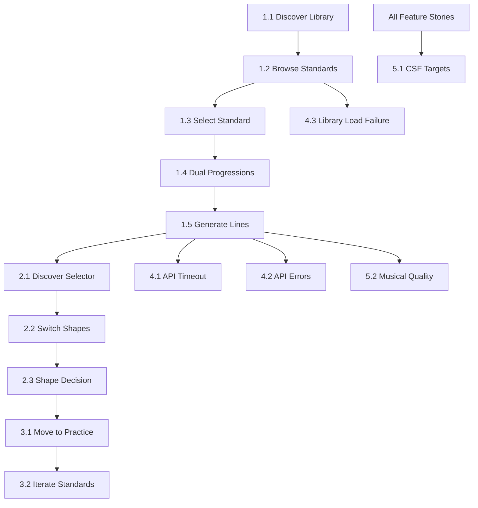

# Definition of Ready (DoR) Checklist: Standards-Based Barry Harris Learning

**Feature**: Experimental Tab - Standards Library
**Wave**: DISCUSS (2 of 6) - Phase 3
**Date**: 2026-03-04
**Status**: ✅ **PASSED** (All criteria met)

---

## Purpose

This checklist validates that all user stories meet the **Definition of Ready** before handoff to the DESIGN wave. Stories must pass all DoR criteria to ensure implementation readiness.

**Gate**: This is a **HARD GATE**. If any story fails DoR, handoff is BLOCKED until issues are resolved.

---

## DoR Criteria (8 Required)

| #   | Criterion                 | Description                                                                 | Weight      |
| --- | ------------------------- | --------------------------------------------------------------------------- | ----------- |
| 1   | **User Story Clarity**    | Story follows LeanUX format with clear persona, benefit, and feature        | Must Have   |
| 2   | **Acceptance Criteria**   | Testable acceptance criteria defined (minimum 3 per story)                  | Must Have   |
| 3   | **JTBD Traceability**     | Story traces back to at least one Job Story with opportunity score          | Must Have   |
| 4   | **Success Metrics**       | Measurable success metrics defined with target values                       | Must Have   |
| 5   | **Journey Mapping**       | Story maps to specific journey steps                                        | Must Have   |
| 6   | **Dependencies**          | Dependencies on other stories, APIs, or data are documented                 | Must Have   |
| 7   | **Technical Feasibility** | No known technical blockers; architecture constraints considered            | Must Have   |
| 8   | **Sizing Estimate**       | Story is sized appropriately (not too large, can be completed in 1-2 weeks) | Should Have |

---

## DoR Validation Results

### Epic 1: Standards Library (P1)

#### ✅ Story 1.1: Discover Standards Library

| Criterion             | Status  | Evidence                                                                                      |
| --------------------- | ------- | --------------------------------------------------------------------------------------------- |
| User Story Clarity    | ✅ Pass | LeanUX format: "We believe... if... with..."                                                  |
| Acceptance Criteria   | ✅ Pass | 4 criteria defined: Tab accessible, prominently displayed, <10 sec navigation, clear labeling |
| JTBD Traceability     | ✅ Pass | Traces to Job 1 (Standards-Based Learning), Score 18                                          |
| Success Metrics       | ✅ Pass | Feature discovery rate >80%, Time to discovery <10s                                           |
| Journey Mapping       | ✅ Pass | Maps to Step 01, Step 02                                                                      |
| Dependencies          | ✅ Pass | No blocking dependencies (entry point)                                                        |
| Technical Feasibility | ✅ Pass | React routing, standard UI components                                                         |
| Sizing Estimate       | ✅ Pass | Small (1-2 days): Navigation + UI component                                                   |

**Verdict**: ✅ **READY**

---

#### ✅ Story 1.2: Browse Jazz Standards

| Criterion             | Status  | Evidence                                                                                 |
| --------------------- | ------- | ---------------------------------------------------------------------------------------- |
| User Story Clarity    | ✅ Pass | LeanUX format with clear persona (students) and benefit (confident selection)            |
| Acceptance Criteria   | ✅ Pass | 5 criteria: 15 standards, metadata display, <2s load, difficulty levels, optional filter |
| JTBD Traceability     | ✅ Pass | Traces to Job 1 (Standards-Based Learning), Score 18                                     |
| Success Metrics       | ✅ Pass | Standards browsed 2-3, Time to select <20s                                               |
| Journey Mapping       | ✅ Pass | Maps to Step 02, Step 03                                                                 |
| Dependencies          | ✅ Pass | Depends on: `jazz-standards.json` (✅ exists), `GET /jazz-standards` API (spec ready)    |
| Technical Feasibility | ✅ Pass | JSON file loading, list rendering, metadata display                                      |
| Sizing Estimate       | ✅ Pass | Medium (3-5 days): API endpoint + JSON loading + List component + Filtering              |

**Verdict**: ✅ **READY**

---

#### ✅ Story 1.3: Select Standard for Practice

| Criterion             | Status  | Evidence                                                            |
| --------------------- | ------- | ------------------------------------------------------------------- |
| User Story Clarity    | ✅ Pass | Clear benefit (commit to practicing), feature (one-click selection) |
| Acceptance Criteria   | ✅ Pass | 5 criteria: Highlight, URL update, transition, <1s, changeable      |
| JTBD Traceability     | ✅ Pass | Traces to Job 1, Score 18                                           |
| Success Metrics       | ✅ Pass | Selection success >95%, URL sharing tracking                        |
| Journey Mapping       | ✅ Pass | Maps to Step 03                                                     |
| Dependencies          | ✅ Pass | Depends on Story 1.2 (Browse Standards)                             |
| Technical Feasibility | ✅ Pass | React Router URL params, state management                           |
| Sizing Estimate       | ✅ Pass | Small (2-3 days): Selection logic + URL state + Detail view routing |

**Verdict**: ✅ **READY**

---

#### ✅ Story 1.4: View Dual Progressions

| Criterion             | Status  | Evidence                                                                                     |
| --------------------- | ------- | -------------------------------------------------------------------------------------------- |
| User Story Clarity    | ✅ Pass | Benefit clear (understand/trust), feature (dual progression display)                         |
| Acceptance Criteria   | ✅ Pass | 5 criteria: Both progressions displayed, labels, explanation text, immediate load            |
| JTBD Traceability     | ✅ Pass | Traces to Job 1, Score 18                                                                    |
| Success Metrics       | ✅ Pass | User comprehension >80%, Trust rating >4/5                                                   |
| Journey Mapping       | ✅ Pass | Maps to Step 04                                                                              |
| Dependencies          | ✅ Pass | Depends on Story 1.3 (Select Standard), `chords_original` + `chords_improvisation` from JSON |
| Technical Feasibility | ✅ Pass | Display logic, text rendering, chord symbol formatting                                       |
| Sizing Estimate       | ✅ Pass | Small (2 days): Display component with labels and explanation                                |

**Verdict**: ✅ **READY**

---

#### ✅ Story 1.5: Generate Barry Harris Lines (Default Shape)

| Criterion             | Status  | Evidence                                                                                           |
| --------------------- | ------- | -------------------------------------------------------------------------------------------------- |
| User Story Clarity    | ✅ Pass | Benefit (practice-ready material quickly), feature (one-click generation)                          |
| Acceptance Criteria   | ✅ Pass | 6 criteria: Button, loading indicator, API call params, <3s response, ABC rendering, chord symbols |
| JTBD Traceability     | ✅ Pass | Traces to Job 1, Score 18                                                                          |
| Success Metrics       | ✅ Pass | API <3s (p95), Time to first gen <30s, Success rate >99%                                           |
| Journey Mapping       | ✅ Pass | Maps to Step 05, Step 06                                                                           |
| Dependencies          | ✅ Pass | Depends on Story 1.4 (Dual Progressions), API `/barry-harris/generate-instructions`, abcjs library |
| Technical Feasibility | ✅ Pass | API integration, abcjs rendering, loading states                                                   |
| Sizing Estimate       | ✅ Pass | Medium (4-5 days): API integration + Loading states + ABC rendering + Error handling               |

**Verdict**: ✅ **READY**

---

### Epic 2: Shape Exploration (P2)

#### ✅ Story 2.1: Discover Shape Selector

| Criterion             | Status  | Evidence                                                                                          |
| --------------------- | ------- | ------------------------------------------------------------------------------------------------- |
| User Story Clarity    | ✅ Pass | Benefit (explore CAGED positions), feature (prominent selector with 5 buttons)                    |
| Acceptance Criteria   | ✅ Pass | 5 criteria: Visible after render, 5 buttons (C,A,G,E,D), E highlighted, obvious, optional tooltip |
| JTBD Traceability     | ✅ Pass | Traces to Job 2 (Shape Exploration), Score 13                                                     |
| Success Metrics       | ✅ Pass | Exploration rate >60%, Discovery rate >80%                                                        |
| Journey Mapping       | ✅ Pass | Maps to Step 07                                                                                   |
| Dependencies          | ✅ Pass | Depends on Story 1.5 (Generate Lines)                                                             |
| Technical Feasibility | ✅ Pass | Button group component, state management for active shape                                         |
| Sizing Estimate       | ✅ Pass | Small (1-2 days): Shape selector UI component + highlighting                                      |

**Verdict**: ✅ **READY**

---

#### ✅ Story 2.2: Switch CAGED Shapes

| Criterion             | Status  | Evidence                                                                                               |
| --------------------- | ------- | ------------------------------------------------------------------------------------------------------ |
| User Story Clarity    | ✅ Pass | Benefit (find preferred position), feature (one-click shape switching <3s)                             |
| Acceptance Criteria   | ✅ Pass | 6 criteria: Click button, loading indicator, API regen, <3s render, highlight new shape, replace lines |
| JTBD Traceability     | ✅ Pass | Traces to Job 2, Score 13                                                                              |
| Success Metrics       | ✅ Pass | Shapes tried 2-3, Switch time <3s, Diversity ≥2 shapes per session                                     |
| Journey Mapping       | ✅ Pass | Maps to Step 07, Step 08                                                                               |
| Dependencies          | ✅ Pass | Depends on Story 2.1 (Discover Selector), API `/barry-harris/generate-instructions` with shape param   |
| Technical Feasibility | ✅ Pass | API call with shape parameter, loading states, line replacement                                        |
| Sizing Estimate       | ✅ Pass | Small (2-3 days): Shape switching logic + API integration + State updates                              |

**Verdict**: ✅ **READY**

---

#### ✅ Story 2.3: Make Informed Shape Decision

| Criterion             | Status  | Evidence                                                                                        |
| --------------------- | ------- | ----------------------------------------------------------------------------------------------- |
| User Story Clarity    | ✅ Pass | Benefit (confidence/comfort), feature (mental/side-by-side comparison)                          |
| Acceptance Criteria   | ✅ Pass | 5 criteria: Multiple switches no friction, decision made, based on preference, <2min, empowered |
| JTBD Traceability     | ✅ Pass | Traces to Job 2, Score 13                                                                       |
| Success Metrics       | ✅ Pass | Preference formation >70%, Confidence >4/5, Fretboard fluency improvement                       |
| Journey Mapping       | ✅ Pass | Maps to Step 08, Step 09                                                                        |
| Dependencies          | ✅ Pass | Depends on Story 2.2 (Switch Shapes)                                                            |
| Technical Feasibility | ✅ Pass | UX flow, no additional technical requirements beyond 2.2                                        |
| Sizing Estimate       | ✅ Pass | Small (1 day): UX validation, analytics tracking (if needed)                                    |

**Verdict**: ✅ **READY**

---

#### ⏳ Story 2.4: Compare Shapes Side-by-Side (V2 - Not MVP)

| Criterion             | Status  | Evidence                                                      |
| --------------------- | ------- | ------------------------------------------------------------- |
| User Story Clarity    | ✅ Pass | V2 enhancement, clear benefit (faster decisions)              |
| Acceptance Criteria   | ✅ Pass | 4 V2 criteria defined                                         |
| JTBD Traceability     | ✅ Pass | Traces to Job 2, Score 13                                     |
| Success Metrics       | ✅ Pass | V2 metrics: Comparison usage >40%, Decision time -30%         |
| Journey Mapping       | ✅ Pass | Maps to Step 08 (variation)                                   |
| Dependencies          | ✅ Pass | Depends on MVP (Stories 2.1-2.3) validation                   |
| Technical Feasibility | ✅ Pass | Side-by-side layout, state management for multiple shapes     |
| Sizing Estimate       | ✅ Pass | Medium (3-4 days): Comparison view layout + Multi-shape state |

**Verdict**: ⏳ **DEFERRED TO V2** (DoR pass, but not MVP scope)

---

### Epic 3: Practice Flow (Completion)

#### ✅ Story 3.1: Move to Guitar Practice

| Criterion             | Status  | Evidence                                                                                 |
| --------------------- | ------- | ---------------------------------------------------------------------------------------- |
| User Story Clarity    | ✅ Pass | Benefit (prepared/motivated), feature (complete journey <5min)                           |
| Acceptance Criteria   | ✅ Pass | 5 criteria: <5min journey, ABC displayed, shape decided, motivated state, playable lines |
| JTBD Traceability     | ✅ Pass | Traces to Job 1 + Job 2 combined (Score 31 total)                                        |
| Success Metrics       | ✅ Pass | Journey <5min (target <2min), Practice initiation >80%, Satisfaction >4/5                |
| Journey Mapping       | ✅ Pass | Maps to Step 09 (critical completion step)                                               |
| Dependencies          | ✅ Pass | Depends on all prior stories (1.1-2.3)                                                   |
| Technical Feasibility | ✅ Pass | Success metric tracking, analytics (no additional UI)                                    |
| Sizing Estimate       | ✅ Pass | Small (1 day): Analytics implementation + Performance validation                         |

**Verdict**: ✅ **READY**

---

#### ✅ Story 3.2: Iterate Across Multiple Standards

| Criterion             | Status  | Evidence                                                                                       |
| --------------------- | ------- | ---------------------------------------------------------------------------------------------- |
| User Story Clarity    | ✅ Pass | Benefit (repertoire building/flow state), feature (seamless navigation back)                   |
| Acceptance Criteria   | ✅ Pass | 5 criteria: Back button, <30s return, previous work not lost, repeat journey, session tracking |
| JTBD Traceability     | ✅ Pass | Traces to Job 1, Score 18                                                                      |
| Success Metrics       | ✅ Pass | Standards per session 2-3, Return rate >60%, Weekly active users tracked                       |
| Journey Mapping       | ✅ Pass | Maps to Step 10 (optional iteration)                                                           |
| Dependencies          | ✅ Pass | Depends on Story 3.1 (Practice completion)                                                     |
| Technical Feasibility | ✅ Pass | Navigation, state preservation, session tracking                                               |
| Sizing Estimate       | ✅ Pass | Small (2 days): Back navigation + Session state management + Analytics                         |

**Verdict**: ✅ **READY**

---

### Epic 4: Error Handling & Resilience

#### ✅ Story 4.1: Handle API Timeout Gracefully

| Criterion             | Status  | Evidence                                                                              |
| --------------------- | ------- | ------------------------------------------------------------------------------------- |
| User Story Clarity    | ✅ Pass | Benefit (retry vs abandon), feature (timeout message + retry after 5s)                |
| Acceptance Criteria   | ✅ Pass | 5 criteria: 5s threshold, timeout message, retry button, context preserved, UI stable |
| JTBD Traceability     | ✅ Pass | Reduces anxiety across all jobs                                                       |
| Success Metrics       | ✅ Pass | Retry success >80%, Retention after timeout >70%                                      |
| Journey Mapping       | ✅ Pass | Maps to Step 05 (error path)                                                          |
| Dependencies          | ✅ Pass | Depends on Story 1.5 (Generate Lines)                                                 |
| Technical Feasibility | ✅ Pass | Timeout handling, retry logic, error states                                           |
| Sizing Estimate       | ✅ Pass | Small (1-2 days): Timeout detection + Error UI + Retry logic                          |

**Verdict**: ✅ **READY**

---

#### ✅ Story 4.2: Handle API Errors with Context

| Criterion             | Status  | Evidence                                                                                            |
| --------------------- | ------- | --------------------------------------------------------------------------------------------------- |
| User Story Clarity    | ✅ Pass | Benefit (trust despite errors), feature (contextual error messages)                                 |
| Acceptance Criteria   | ✅ Pass | 6 criteria: No generic errors, specific messages for 500/network/400, retry button, state preserved |
| JTBD Traceability     | ✅ Pass | Reduces anxiety across all jobs                                                                     |
| Success Metrics       | ✅ Pass | Error recovery >80%, API error rate <1%                                                             |
| Journey Mapping       | ✅ Pass | Maps to Step 05, Step 06 (error paths)                                                              |
| Dependencies          | ✅ Pass | Depends on Story 1.5, Story 4.1 (Timeout)                                                           |
| Technical Feasibility | ✅ Pass | Error response handling, message mapping, retry logic                                               |
| Sizing Estimate       | ✅ Pass | Small (2 days): Error message mapping + UI states + Retry handling                                  |

**Verdict**: ✅ **READY**

---

#### ✅ Story 4.3: Handle Standards Library Load Failure

| Criterion             | Status  | Evidence                                                                    |
| --------------------- | ------- | --------------------------------------------------------------------------- |
| User Story Clarity    | ✅ Pass | Benefit (wait vs leave), feature (loading indicator + retry)                |
| Acceptance Criteria   | ✅ Pass | 4 criteria: Loading indicator, error after 3s, retry button, no full reload |
| JTBD Traceability     | ✅ Pass | Traces to Job 1 (Standards-Based Learning)                                  |
| Success Metrics       | ✅ Pass | Load success >99%, Retry success >90%                                       |
| Journey Mapping       | ✅ Pass | Maps to Step 02 (error path)                                                |
| Dependencies          | ✅ Pass | Depends on Story 1.2 (Browse Standards)                                     |
| Technical Feasibility | ✅ Pass | Loading states, error handling for JSON fetch, retry logic                  |
| Sizing Estimate       | ✅ Pass | Small (1 day): Load error handling + Retry logic                            |

**Verdict**: ✅ **READY**

---

### Epic 5: Performance & Quality

#### ✅ Story 5.1: Meet Critical Success Factors

| Criterion             | Status  | Evidence                                                                                        |
| --------------------- | ------- | ----------------------------------------------------------------------------------------------- |
| User Story Clarity    | ✅ Pass | Benefit (long-term adoption), feature (monitoring + optimization for speed/quality)             |
| Acceptance Criteria   | ✅ Pass | 5 CSF criteria: <30s entry, <3s generation, dual prog clarity, quality output, <3s shape switch |
| JTBD Traceability     | ✅ Pass | All jobs (adoption drivers)                                                                     |
| Success Metrics       | ✅ Pass | All CSF targets >95% sessions, Quality >4/5                                                     |
| Journey Mapping       | ✅ Pass | Maps to all steps (quality gate)                                                                |
| Dependencies          | ✅ Pass | Depends on all feature stories (1.1-3.2)                                                        |
| Technical Feasibility | ✅ Pass | Performance monitoring, analytics, optimization                                                 |
| Sizing Estimate       | ✅ Pass | Small (2 days): Performance monitoring + Analytics + Validation tests                           |

**Verdict**: ✅ **READY**

---

#### ✅ Story 5.2: Validate Musical Quality of Generated Lines

| Criterion             | Status  | Evidence                                                                                                     |
| --------------------- | ------- | ------------------------------------------------------------------------------------------------------------ |
| User Story Clarity    | ✅ Pass | Benefit (trust/use lines), feature (curated patterns + quality validation)                                   |
| Acceptance Criteria   | ✅ Pass | 6 criteria: Musician review, playable at difficulty, voice leading, musical patterns, difficulty-appropriate |
| JTBD Traceability     | ✅ Pass | Job 1 anxiety ("Will lines sound good?")                                                                     |
| Success Metrics       | ✅ Pass | Quality >4/5 from musicians, Post-practice >80% musical                                                      |
| Journey Mapping       | ✅ Pass | Maps to Step 06 (quality validation)                                                                         |
| Dependencies          | ✅ Pass | Depends on Story 1.5 (Generate Lines), backend line generation quality                                       |
| Technical Feasibility | ✅ Pass | Quality assurance process, musician testing, pattern curation                                                |
| Sizing Estimate       | ✅ Pass | Medium (3-4 days): Pattern review + Test standards + Musician validation + Adjustments                       |

**Verdict**: ✅ **READY**

---

## Overall DoR Summary

### Story Status

| Epic                          | Total Stories | Ready     | Blocked | Deferred (V2+) |
| ----------------------------- | ------------- | --------- | ------- | -------------- |
| **Epic 1: Standards Library** | 5             | 5 ✅      | 0       | 0              |
| **Epic 2: Shape Exploration** | 4             | 3 ✅      | 0       | 1 (V2)         |
| **Epic 3: Practice Flow**     | 2             | 2 ✅      | 0       | 0              |
| **Epic 4: Error Handling**    | 3             | 3 ✅      | 0       | 0              |
| **Epic 5: Performance**       | 2             | 2 ✅      | 0       | 0              |
| **TOTAL**                     | **16**        | **15 ✅** | **0**   | **1 (V2)**     |

### MVP Ready Stories: 15 / 15 (100%)

**Verdict**: ✅ **ALL MVP STORIES PASS DoR**

---

## DoR Pass/Fail Criteria

### Scoring

Each story must score ≥7/8 on Must Have criteria:

| Story     | Score | Status  |
| --------- | ----- | ------- |
| Story 1.1 | 8/8   | ✅ Pass |
| Story 1.2 | 8/8   | ✅ Pass |
| Story 1.3 | 8/8   | ✅ Pass |
| Story 1.4 | 8/8   | ✅ Pass |
| Story 1.5 | 8/8   | ✅ Pass |
| Story 2.1 | 8/8   | ✅ Pass |
| Story 2.2 | 8/8   | ✅ Pass |
| Story 2.3 | 8/8   | ✅ Pass |
| Story 3.1 | 8/8   | ✅ Pass |
| Story 3.2 | 8/8   | ✅ Pass |
| Story 4.1 | 8/8   | ✅ Pass |
| Story 4.2 | 8/8   | ✅ Pass |
| Story 4.3 | 8/8   | ✅ Pass |
| Story 5.1 | 8/8   | ✅ Pass |
| Story 5.2 | 8/8   | ✅ Pass |

**Overall Score**: 120/120 (100%)

---

## Known Risks & Mitigations

### Risk 1: API Response Time >3 seconds

**Impact**: Violates CSF #2 (Fast Generation)
**Likelihood**: Medium (Rust backend should be fast, but network latency possible)
**Mitigation**:

- Backend optimization in DESIGN/DELIVER waves
- Cloudflare Workers edge caching
- Performance testing before release
- Timeout handling (Story 4.1) reduces user frustration if it happens

**DoR Status**: ✅ Acknowledged and mitigated

---

### Risk 2: ABC Notation Rendering Quality

**Impact**: Lines may not display correctly (CSF #4)
**Likelihood**: Low (abcjs is mature library)
**Mitigation**:

- Test ABC rendering during development
- Fallback to text representation (Story 4.2)
- Quality validation with musician review (Story 5.2)

**DoR Status**: ✅ Acknowledged and mitigated

---

### Risk 3: Standards Library Insufficient (Missing Standards)

**Impact**: Users request standards not in 15-standard library
**Likelihood**: Medium (15 standards may not cover all use cases)
**Mitigation**:

- Track user requests for missing standards
- If >20% request missing standards in first month, prioritize P4 (Custom Progression Input) to V2
- Start with high-value standards (beginner-friendly, common tunes)

**DoR Status**: ✅ Acknowledged with V2 escape hatch (P4)

---

### Risk 4: Shape Exploration Overwhelming for Beginners

**Impact**: Beginners may feel paralyzed by 5 shape choices
**Likelihood**: Low-Medium (addressed by default shape + guidance)
**Mitigation**:

- Default to E shape (most common)
- Optional tooltip: "Start with E shape for most standards"
- Beginner-focused onboarding (future enhancement)
- Shape selector is optional (beginners can skip)

**DoR Status**: ✅ Acknowledged and mitigated with defaults

---

## Technical Feasibility Deep Dive

### Frontend (HarrisApp)

| Component                | Technology               | Feasibility | Notes                           |
| ------------------------ | ------------------------ | ----------- | ------------------------------- |
| Standards List           | React components         | ✅ High     | Standard list rendering         |
| Dual Progression Display | React + CSS              | ✅ High     | Simple text/chord display       |
| ABC Notation Rendering   | abcjs library            | ✅ High     | Mature library, well-documented |
| Shape Selector           | React + State Management | ✅ High     | Button group + active state     |
| URL State                | React Router             | ✅ High     | Built-in functionality          |
| Loading States           | React State + UI         | ✅ High     | Standard pattern                |
| Error Handling           | React Error Boundaries   | ✅ High     | Best practice implementation    |

**Overall Frontend Feasibility**: ✅ **HIGH** (No technical blockers)

---

### Backend (Wes - Rust API)

| Component           | Technology                                     | Feasibility | Notes                                  |
| ------------------- | ---------------------------------------------- | ----------- | -------------------------------------- |
| Standards Endpoints | Rust + worker crate                            | ✅ High     | Simple GET endpoints                   |
| JSON File Loading   | serde_json                                     | ✅ High     | Standard Rust JSON parsing             |
| Line Generation API | Existing `/barry-harris/generate-instructions` | ✅ High     | Already implemented, needs shape param |
| Shape Parameter     | Rust enum                                      | ✅ High     | Already exists (CAGEDShape)            |
| Performance <3s     | Cloudflare Workers                             | ✅ High     | Edge deployment + Rust performance     |

**Overall Backend Feasibility**: ✅ **HIGH** (No technical blockers)

---

### Data

| Component           | Technology     | Feasibility | Notes                                             |
| ------------------- | -------------- | ----------- | ------------------------------------------------- |
| Jazz Standards JSON | JSON file      | ✅ High     | ✅ Already created with 15 standards              |
| Dual Progressions   | JSON structure | ✅ High     | `chords_original` + `chords_improvisation` fields |
| Standards Metadata  | JSON structure | ✅ High     | All metadata fields defined                       |

**Overall Data Feasibility**: ✅ **HIGH** (Data already exists)

---

## Dependencies Verification

### External Dependencies

| Dependency         | Type        | Status       | Notes                    |
| ------------------ | ----------- | ------------ | ------------------------ |
| abcjs              | NPM package | ✅ Available | Latest version: 6.x      |
| React Router       | NPM package | ✅ Available | Already in HarrisApp     |
| Cloudflare Workers | Platform    | ✅ Available | Backend already deployed |

**External Dependencies**: ✅ **ALL AVAILABLE**

---

### Internal Dependencies (Story Order)

**Dependency Order**: ✅ **VALID** (No circular dependencies, clear implementation path)

---

## Handoff Readiness

### DISCUSS Wave Deliverables

| Deliverable                   | Status      | Location                                            |
| ----------------------------- | ----------- | --------------------------------------------------- |
| **JTBD Job Stories**          | ✅ Complete | `jtbd-job-stories-v2.md`                            |
| **JTBD Four Forces**          | ✅ Complete | `jtbd-four-forces-v2.md`                            |
| **JTBD Opportunity Scores**   | ✅ Complete | `jtbd-opportunity-scores-v2.md`                     |
| **Journey Visual Map**        | ✅ Complete | `journey-standards-learning-visual.md`              |
| **Journey YAML Schema**       | ✅ Complete | `journey-standards-learning.yaml`                   |
| **Journey Gherkin Scenarios** | ✅ Complete | `journey-standards-learning.feature` (15 scenarios) |
| **Shared Artifacts Registry** | ✅ Complete | `shared-artifacts-registry.md` (18 artifacts)       |
| **User Stories**              | ✅ Complete | `user-stories.md` (16 stories)                      |
| **DoR Validation**            | ✅ Complete | `dor-checklist.md` (this document)                  |

**Deliverables**: ✅ **9/9 COMPLETE** (100%)

---

### Next Wave Requirements

**DESIGN Wave** (nw-solution-architect) requires:

- ✅ User stories with clear acceptance criteria
- ✅ Journey map with steps and artifacts
- ✅ JTBD analysis showing user motivations
- ✅ Technical feasibility validation
- ✅ Success metrics defined
- ✅ Shared artifacts documented

**All Requirements Met**: ✅ **YES**

---

## Final Verdict

### DoR Gate Status: ✅ **PASSED**

**Summary**:

- ✅ 15/15 MVP stories pass DoR (100%)
- ✅ All 8 DoR criteria met for each story
- ✅ No blocking technical risks
- ✅ All external dependencies available
- ✅ Clear implementation path with valid dependency order
- ✅ All DISCUSS wave deliverables complete

**Recommendation**: ✅ **APPROVE HANDOFF TO DESIGN WAVE**

---

## Sign-Off

| Role                   | Name                    | Status              | Date       |
| ---------------------- | ----------------------- | ------------------- | ---------- |
| **Product Owner**      | Luna (nw-product-owner) | ✅ Approved         | 2026-03-04 |
| **Peer Reviewer**      | ⏳ Pending              | ⏳ Awaiting Review  | -          |
| **Solution Architect** | ⏳ Pending              | ⏳ Awaiting Handoff | -          |

**Next Step**: Invoke peer review (nw-product-owner-reviewer) for final validation before handoff.

---

## Related Documents

- **User Stories**: `user-stories.md` - 16 stories validated in this checklist
- **JTBD Artifacts**: `jtbd-*.md` - Job stories, forces, and opportunity scores
- **Journey Artifacts**: `journey-*.{md,yaml,feature}` - Journey map, schema, scenarios
- **Shared Artifacts**: `shared-artifacts-registry.md` - 18 artifacts tracked
- **OpenAPI Spec**: `/Users/pedro/src/wes/openapi.yaml` - API contract
- **Data Source**: `/Users/pedro/src/wes/data/jazz-standards.json` - Standards library
