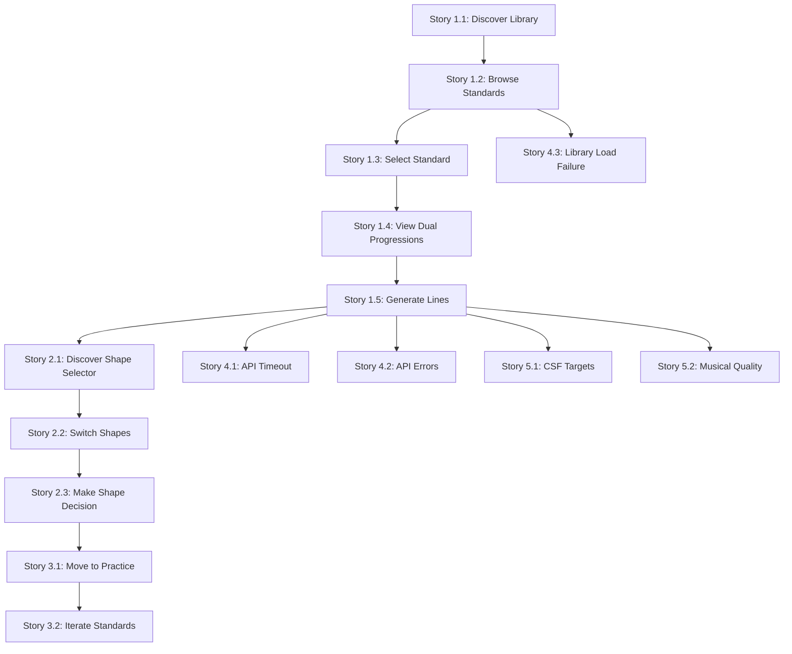

# User Stories: Standards-Based Barry Harris Learning

**Feature**: Experimental Tab - Standards Library
**Wave**: DISCUSS (2 of 6) - Phase 3
**Date**: 2026-03-04

---

## Story Format

Stories use **LeanUX format** with **explicit JTBD tracing**:

```
**We believe** [outcome] will be achieved
**if** [persona] attains [benefit]
**with** [feature]

**Job Trace**: Links to JTBD job story
**Journey Steps**: Maps to journey steps
**Success Metrics**: How we measure outcome
```

---

## MVP User Stories (P1 + P2)

### Epic 1: Standards Library (P1)

---

#### Story 1.1: Discover Standards Library

**We believe** jazz students will start using the app for structured practice
**if** they discover the standards library immediately upon opening the experimental tab
**with** a prominent, clearly labeled "Standards Library" feature

**Job Trace**: Job 1 (Standards-Based Barry Harris Learning) - Opportunity Score: 18
**Journey Steps**: Step 01, Step 02
**Priority**: Must Have (MVP Blocker)

**Why This Matters**:

- Frictionless entry (<30 sec from app open to generation)
- Reduces "What should I practice?" anxiety
- Familiar entry point (jazz standards are known territory)

**Acceptance Criteria**:

- [ ] Experimental tab is accessible from main navigation
- [ ] Standards Library is prominently displayed (not buried in menu)
- [ ] User can navigate from app open to standards library in <10 seconds
- [ ] Clear labeling: "Standards Library" (not ambiguous)

**Success Metrics**:

- Feature discovery rate: >80% of users find library in first session
- Time to discovery: <10 seconds from app open

---

#### Story 1.2: Browse Jazz Standards

**We believe** students will feel confident selecting practice material
**if** they can browse a curated library with metadata (difficulty, tempo, composer)
**with** a standards list displaying 15 familiar jazz standards

**Job Trace**: Job 1 (Standards-Based Barry Harris Learning) - Opportunity Score: 18
**Journey Steps**: Step 02, Step 03
**Priority**: Must Have (MVP Blocker)

**Why This Matters**:

- Provides familiar context for learning new method
- Difficulty filtering reduces beginner anxiety
- Metadata (tempo, composer, key) helps informed selection

**Acceptance Criteria**:

- [ ] Library displays 15 jazz standards
- [ ] Each standard shows: name, composer, key, difficulty, tempo, form
- [ ] Standards load within 2 seconds
- [ ] Difficulty levels: beginner (5), intermediate (6), advanced (4)
- [ ] Optional: Filter by difficulty, key, or search by name

**Success Metrics**:

- Standards browsed per session: 2-3 (target)
- Time to browse and select: <20 seconds

---

#### Story 1.3: Select Standard for Practice

**We believe** students will commit to practicing a specific tune
**if** they can select a standard with one click and see immediate confirmation
**with** a simple selection interaction and URL state persistence

**Job Trace**: Job 1 (Standards-Based Barry Harris Learning) - Opportunity Score: 18
**Journey Steps**: Step 03
**Priority**: Must Have (MVP Blocker)

**Why This Matters**:

- One-click selection reduces friction
- URL state enables sharing ("Check out this standard!")
- Clear selection feedback prevents confusion

**Acceptance Criteria**:

- [ ] User clicks standard → Selection is highlighted
- [ ] URL updates to include `?standard=autumn-leaves`
- [ ] App transitions to standard detail view
- [ ] Selection happens in <1 second
- [ ] User can change selection easily (back button or breadcrumb)

**Success Metrics**:

- Selection success rate: >95% (no confusion about what's selected)
- URL sharing: Track how many users share URLs with `?standard=` param

---

#### Story 1.4: View Dual Progressions

**We believe** students will understand and trust the Barry Harris approach
**if** they see both original and simplified progressions with pedagogical explanation
**with** dual progression display showing original (melody) and improvisation (Barry Harris) versions

**Job Trace**: Job 1 (Standards-Based Barry Harris Learning) - Opportunity Score: 18
**Journey Steps**: Step 04
**Priority**: Must Have (MVP Blocker)

**Why This Matters**:

- Transparency reduces "Is this correct?" anxiety
- Pedagogical explanation builds trust in simplification
- Shows Barry Harris method in action (removes passing chords, clarifies ii-V)
- "Aha moment": User understands the approach

**Acceptance Criteria**:

- [ ] Both progressions displayed clearly (side-by-side or stacked)
- [ ] Original labeled: "Original Progression (Melody/Comping)"
- [ ] Improvisation labeled: "Improvisation Progression (Barry Harris)"
- [ ] Explanation text visible: "Barry Harris simplification removes [specific chords] for clearer ii-V patterns"
- [ ] Progressions load immediately (data from selected standard)

**Success Metrics**:

- User comprehension: Post-session survey "Did you understand why progressions differ?" >80% yes
- Anxiety reduction: "Do you trust the simplified progression?" >4/5 rating

---

#### Story 1.5: Generate Barry Harris Lines (Default Shape)

**We believe** students will receive practice-ready material quickly
**if** they can generate Barry Harris lines with one click and minimal wait time
**with** a "Generate Lines" button triggering API call with default E shape

**Job Trace**: Job 1 (Standards-Based Barry Harris Learning) - Opportunity Score: 18
**Journey Steps**: Step 05, Step 06
**Priority**: Must Have (MVP Blocker)

**Why This Matters**:

- Fast generation (<3 sec) maintains engagement
- Default shape (E) removes decision paralysis
- Loading indicator reduces "Is it working?" anxiety
- From "What should I practice?" to practicing in <30 seconds total

**Acceptance Criteria**:

- [ ] "Generate Lines" button prominently displayed
- [ ] Loading indicator appears immediately on click
- [ ] API call includes: `chords_improvisation`, `caged_shape: E`, `guitar_position: E`
- [ ] API responds in <3 seconds (95th percentile)
- [ ] Generated ABC notation renders correctly
- [ ] Chord symbols aligned with notation

**Success Metrics**:

- API response time: <3 seconds (95th percentile)
- Time to first generation: <30 seconds from app open
- Generation success rate: >99% (no API failures)

---

### Epic 2: Shape Exploration (P2)

---

#### Story 2.1: Discover Shape Selector

**We believe** students will explore different CAGED positions
**if** they notice the shape selector after initial generation
**with** a prominent shape selector displaying C, A, G, E, D buttons with E highlighted

**Job Trace**: Job 2 (Shape Exploration) - Opportunity Score: 13
**Journey Steps**: Step 07
**Priority**: Must Have (MVP Blocker)

**Why This Matters**:

- Shape exploration is core to Barry Harris method
- Fretboard fluency requires exploring multiple positions
- Natural next step after seeing default (E) lines: "What about other shapes?"

**Acceptance Criteria**:

- [ ] Shape selector visible immediately after lines render
- [ ] Five buttons labeled: C, A, G, E, D
- [ ] Current shape (E) is highlighted/visually distinct
- [ ] Shape selector is obvious (not hidden or small)
- [ ] Optional: Tooltip explaining "Explore different fretboard positions"

**Success Metrics**:

- Shape exploration rate: >60% of users try multiple shapes per standard
- Discovery rate: >80% of users notice shape selector

---

#### Story 2.2: Switch CAGED Shapes

**We believe** students will find their preferred fretboard position
**if** they can instantly regenerate lines in different CAGED shapes
**with** one-click shape switching that feels fast (<3 sec)

**Job Trace**: Job 2 (Shape Exploration) - Opportunity Score: 13
**Journey Steps**: Step 07, Step 08
**Priority**: Must Have (MVP Blocker)

**Why This Matters**:

- Different shapes offer different melodic approaches
- Users need to compare to make informed choice
- Fast switching encourages exploration (no friction)
- Builds fretboard confidence

**Acceptance Criteria**:

- [ ] User clicks any shape button (e.g., A)
- [ ] Loading indicator appears immediately
- [ ] API regenerates lines with new shape
- [ ] New lines render in <3 seconds
- [ ] New shape button is highlighted
- [ ] Previous shape lines are replaced (not lost, but not cluttering UI)

**Success Metrics**:

- Shapes tried per standard: 2-3 (target)
- Shape switching time: <3 seconds per switch
- Shape diversity: Users explore at least 2 different shapes per session

---

#### Story 2.3: Make Informed Shape Decision

**We believe** students will practice with confidence and comfort
**if** they can compare shapes and choose based on personal preference
**with** mental comparison (or optional side-by-side) leading to informed decision

**Job Trace**: Job 2 (Shape Exploration) - Opportunity Score: 13
**Journey Steps**: Step 08, Step 09
**Priority**: Must Have (MVP Blocker)

**Why This Matters**:

- Choice builds ownership: "I chose this, not random"
- Confidence in shape selection improves practice quality
- Personal preference matters (hand size, comfort, familiarity)
- Empowerment: User is in control of learning path

**Acceptance Criteria**:

- [ ] User can switch shapes multiple times without friction
- [ ] User makes decision: "I'll practice with [shape]"
- [ ] Decision is based on comfort, melodic preference, or familiarity
- [ ] Total time from generation to decision: <2 minutes
- [ ] User feels empowered (post-session survey)

**Success Metrics**:

- Preference formation: >70% of users consistently return to same shape (indicates informed choice)
- Confidence level: "How confident are you in your shape choice?" >4/5 rating
- Fretboard fluency (self-reported): Pre/post survey showing improvement

---

#### Story 2.4: (Optional) Compare Shapes Side-by-Side

**We believe** students will make faster shape decisions
**if** they can see multiple shapes simultaneously
**with** optional side-by-side comparison view (V2 enhancement, not MVP)

**Job Trace**: Job 2 (Shape Exploration) - Opportunity Score: 13
**Journey Steps**: Step 08
**Priority**: Nice to Have (V2)

**Why This Matters**:

- Reduces cognitive load (no need to remember previous shape)
- Faster comparison leads to quicker decisions
- Visual diff highlights melodic differences

**Acceptance Criteria** (V2):

- [ ] "Compare Shapes" button available after generating 2+ shapes
- [ ] Side-by-side view shows E and A shapes simultaneously
- [ ] User can add more shapes to comparison (up to 5)
- [ ] Comparison view is clear and not cluttered

**Success Metrics** (V2):

- Comparison usage: >40% of users who explore multiple shapes use comparison
- Decision time: Reduced by 30% compared to mental comparison

---

### Epic 3: Practice Flow (Completion)

---

#### Story 3.1: Move to Guitar Practice

**We believe** students will feel prepared and motivated to practice
**if** they complete the journey from app open to guitar in <5 minutes
**with** clear practice material (ABC notation) and shape decision made

**Job Trace**: Job 1 + Job 2 (Combined) - Total Opportunity Score: 31
**Journey Steps**: Step 09
**Priority**: Must Have (MVP Success Metric)

**Why This Matters**:

- Total journey time is critical success factor
- User ends in flow state (motivated, empowered)
- From "What should I practice?" to practicing in <5 minutes
- Success measured by real-world outcome (practicing on guitar)

**Acceptance Criteria**:

- [ ] Total time from app open (Step 01) to practice (Step 09): <5 minutes
- [ ] User has ABC notation displayed
- [ ] User has made shape decision
- [ ] User feels motivated (emotional state: "Motivated & Empowered")
- [ ] Lines are playable and musical

**Success Metrics**:

- Total journey time: <5 minutes (target: <2 minutes for returning users)
- Practice session initiation rate: >80% of users who generate lines actually practice
- Post-practice satisfaction: "Did this help your Barry Harris learning?" >4/5 rating

---

#### Story 3.2: Iterate Across Multiple Standards

**We believe** students will build repertoire and stay in flow state
**if** they can easily return to library and explore more standards
**with** seamless navigation back to standards list and repeat journey

**Job Trace**: Job 1 (Standards-Based Barry Harris Learning) - Opportunity Score: 18
**Journey Steps**: Step 10
**Priority**: Should Have (MVP)

**Why This Matters**:

- Flow state: User wants to continue learning, not stop
- Repertoire building: Multiple standards in one session
- Return rate: Indicator of feature stickiness

**Acceptance Criteria**:

- [ ] "Back to Library" button or breadcrumb visible
- [ ] User returns to standards list within 30 seconds
- [ ] Previous work not lost (can return to previous standard if needed)
- [ ] User can select new standard and repeat journey (Steps 4-9)
- [ ] Session tracking: App tracks standards explored

**Success Metrics**:

- Standards per session: 2-3 (target)
- Return rate: >60% of users return to library after first practice
- Weekly active users: Track repeat usage

---

### Epic 4: Error Handling & Resilience

---

#### Story 4.1: Handle API Timeout Gracefully

**We believe** students will retry generation rather than abandon feature
**if** they see clear feedback when API is slow
**with** timeout message and retry button after 5 seconds

**Job Trace**: All jobs (Anxiety reduction)
**Journey Steps**: Step 05 (error path)
**Priority**: Should Have (MVP)

**Acceptance Criteria**:

- [ ] API timeout threshold: 5 seconds
- [ ] Timeout message appears: "Generation is taking longer than expected"
- [ ] "Retry" button displayed
- [ ] User can retry without losing context (standard, shape)
- [ ] Timeout doesn't break UI state

**Success Metrics**:

- Retry success rate: >80% of retries succeed
- User retention after timeout: >70% of users retry (don't abandon)

---

#### Story 4.2: Handle API Errors with Context

**We believe** students will trust the system despite errors
**if** they see specific error messages with recovery actions
**with** contextual error messages (not generic "Error occurred")

**Job Trace**: All jobs (Anxiety reduction)
**Journey Steps**: Step 05, Step 06 (error paths)
**Priority**: Should Have (MVP)

**Acceptance Criteria**:

- [ ] No generic "Error occurred" messages
- [ ] 500 error: "Unable to generate lines. Please try again."
- [ ] Network error: "Connection lost. Check your internet and retry."
- [ ] 400 error: "Invalid chord progression. Please select another standard."
- [ ] "Retry" button always available
- [ ] Error doesn't clear selected standard or shape

**Success Metrics**:

- Error recovery rate: >80% of users retry after error
- API error rate: <1% (target for production)

---

#### Story 4.3: Handle Standards Library Load Failure

**We believe** students will wait for library to load rather than leave
**if** they see loading indicator and retry option
**with** fallback for library load failures

**Job Trace**: Job 1 (Standards-Based Barry Harris Learning)
**Journey Steps**: Step 02 (error path)
**Priority**: Should Have (MVP)

**Acceptance Criteria**:

- [ ] Loading indicator shown while library loads
- [ ] If load fails after 3 seconds: "Unable to load standards library"
- [ ] "Retry" button displayed
- [ ] User can retry without reloading entire app

**Success Metrics**:

- Library load success rate: >99%
- Retry success rate: >90% of retries succeed

---

### Epic 5: Performance & Quality

---

#### Story 5.1: Meet Critical Success Factors

**We believe** students will adopt the feature long-term
**if** the app meets all performance targets consistently
**with** monitoring and optimization for speed and quality

**Job Trace**: All jobs (Adoption drivers)
**Journey Steps**: All steps
**Priority**: Must Have (MVP Quality Gate)

**Acceptance Criteria**:

- [ ] **CSF 1: Frictionless Entry**: <30 seconds from app open to generation
- [ ] **CSF 2: Fast Generation**: <3 seconds API response (95th percentile)
- [ ] **CSF 3: Dual Progression Clarity**: Both progressions labeled and explained
- [ ] **CSF 4: Quality Musical Output**: Generated lines sound musical at appropriate difficulty
- [ ] **CSF 5: Effortless Shape Exploration**: <3 seconds per shape switch

**Success Metrics**:

- All CSF targets met in >95% of sessions
- User-reported quality: "Lines sound musical" >4/5 rating

---

#### Story 5.2: Validate Musical Quality of Generated Lines

**We believe** students will trust and use generated lines
**if** the lines sound musical and appropriate for difficulty level
**with** curated default patterns and quality validation during development

**Job Trace**: Job 1 (Anxiety: "Will the lines sound good?")
**Journey Steps**: Step 06
**Priority**: Must Have (MVP Quality Gate)

**Acceptance Criteria**:

- [ ] Generated lines reviewed by jazz musician before release
- [ ] Lines are playable at specified difficulty level
- [ ] Voice leading is correct (no awkward jumps)
- [ ] Patterns are musically appropriate (not random)
- [ ] Beginner lines: Simpler patterns (ChordUp, ScaleDown)
- [ ] Advanced lines: More complex patterns (Pivot, ThirdUp, TriadUp)

**Success Metrics**:

- Musical quality rating: >4/5 from test musicians
- Post-practice satisfaction: "Lines sounded musical" >80% agree

---

## Story Dependencies



---

## Story Prioritization (MoSCoW)

### Must Have (MVP Blockers)

- ✅ Story 1.1: Discover Standards Library
- ✅ Story 1.2: Browse Jazz Standards
- ✅ Story 1.3: Select Standard
- ✅ Story 1.4: View Dual Progressions
- ✅ Story 1.5: Generate Barry Harris Lines
- ✅ Story 2.1: Discover Shape Selector
- ✅ Story 2.2: Switch CAGED Shapes
- ✅ Story 2.3: Make Informed Shape Decision
- ✅ Story 3.1: Move to Guitar Practice
- ✅ Story 5.1: Meet Critical Success Factors
- ✅ Story 5.2: Validate Musical Quality

**Total Must Have**: 11 stories

### Should Have (MVP Quality)

- ✅ Story 3.2: Iterate Across Multiple Standards
- ✅ Story 4.1: Handle API Timeout Gracefully
- ✅ Story 4.2: Handle API Errors with Context
- ✅ Story 4.3: Handle Standards Library Load Failure

**Total Should Have**: 4 stories

### Nice to Have (V2)

- ⏳ Story 2.4: Compare Shapes Side-by-Side

**Total Nice to Have**: 1 story

---

## JTBD → Story Traceability Matrix

| Job Story                                        | Opportunity Score | User Stories                                 |
| ------------------------------------------------ | ----------------- | -------------------------------------------- |
| **Job 1: Standards-Based Barry Harris Learning** | 18                | Story 1.1, 1.2, 1.3, 1.4, 1.5, 3.1, 3.2, 4.3 |
| **Job 2: Shape Exploration**                     | 13                | Story 2.1, 2.2, 2.3, 2.4 (V2), 3.1           |
| **Job 3: Pattern Understanding** (V2)            | 11                | _(Deferred to V2)_                           |
| **Job 4: Custom Progression** (V3)               | 8                 | _(Deferred to V3)_                           |

**Coverage**: All high-priority jobs (P1, P2) have complete story coverage for MVP.

---

## Success Metrics Summary

| Epic                          | Key Metric                    | Target                   |
| ----------------------------- | ----------------------------- | ------------------------ |
| **Epic 1: Standards Library** | Feature discovery rate        | >80%                     |
| **Epic 1: Standards Library** | Time to first generation      | <30 seconds              |
| **Epic 1: Standards Library** | Standards browsed per session | 2-3                      |
| **Epic 2: Shape Exploration** | Shape exploration rate        | >60% try multiple shapes |
| **Epic 2: Shape Exploration** | Shapes tried per standard     | 2-3                      |
| **Epic 3: Practice Flow**     | Total journey time            | <5 minutes               |
| **Epic 3: Practice Flow**     | Post-practice satisfaction    | >4/5 rating              |
| **Epic 4: Error Handling**    | Retry success rate            | >80%                     |
| **Epic 5: Performance**       | API response time (p95)       | <3 seconds               |
| **Epic 5: Performance**       | Musical quality rating        | >4/5                     |

---

## Next Steps

These user stories inform:

1. **Acceptance Criteria Document** (next) - Detailed testable criteria for each story
2. **Definition of Ready Validation** - Ensure all stories meet DoR checklist
3. **Peer Review** - Get approval before handoff to DESIGN wave
4. **Architecture Design** (DESIGN wave) - System design for MVP (P1+P2)
5. **Sprint Planning** (DELIVER wave) - Break stories into tasks

---

## Related Documents

- **JTBD Job Stories**: `jtbd-job-stories-v2.md` - Job stories that inform user stories
- **JTBD Four Forces**: `jtbd-four-forces-v2.md` - Adoption drivers and anxiety reduction strategies
- **JTBD Opportunity Scores**: `jtbd-opportunity-scores-v2.md` - Prioritization rationale
- **Journey Visual Map**: `journey-standards-learning-visual.md` - Narrative journey
- **Journey YAML Schema**: `journey-standards-learning.yaml` - Formal structure
- **Journey Gherkin Scenarios**: `journey-standards-learning.feature` - Executable tests
- **Shared Artifacts Registry**: `shared-artifacts-registry.md` - Data flow documentation
